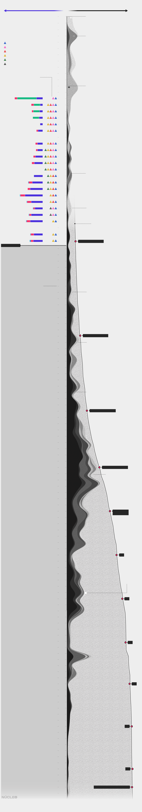
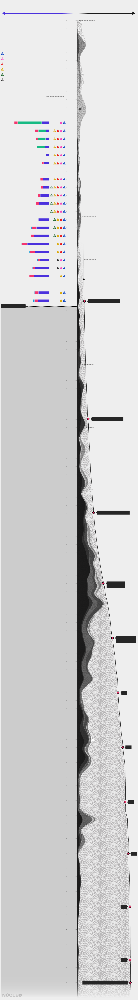

No dia 13 de setembro de 2019, servidores do [Ibama](https://www.ibama.gov.br/) (Instituto Brasileiro do Meio Ambiente e dos Recursos Naturais Renováveis) emitiram um alerta para o Ministério do Meio Ambiente: faltava pessoal para realizar todos os trabalhos de campo e de escritório necessários na resposta ao desastre ambiental provocado pelo vazamento de óleo nas praias do Nordeste. As equipes acompanhavam o incidente desde 2 de setembro e, até então, o óleo já havia atingido praias de Sergipe, Rio Grande do Norte e Pernambuco.

Quinze dias depois, em 28 de setembro, o óleo já se tinha chegado ao Ceará, Bahia e Maranhão. A reclamação persistiu: “Número reduzido da equipe do Ibama para realizar todos os trabalhos de campo necessários”, diz um relatório enviado naquela data, obtido por meio da Lei de Acesso à Informação. Os documentos, que somam 450 páginas, cobrem o período de 2 de setembro a 4 de outubro.

Além do número insuficiente de pessoas para lidar com o maior desastre do tipo já registrado no país, os funcionários do Ibama chamaram a atenção diariamente, durante 32 dias, para a “falta de envolvimento de outros órgãos na solução do problema”. Mais de um mês depois, em 4 de outubro, um relatório aponta a dificuldade em adotar a ferramenta adequada para avaliar a contaminação das praias porque as equipes responsáveis não tinham sido capacitadas.

---

###### É importante porque...

- *Mostra as dificuldades da principal agência ambiental brasileira*

- *Trata-se de um dos maiores desastres ambientais da história do Brasil*

---

Mesmo alertado das dificuldades enfrentadas na linha de frente do desastre, o Ministério do Meio Ambiente não acionou o [PNC](http://www.planalto.gov.br/ccivil_03/_Ato2011-2014/2013/Decreto/D8127.htm) (Plano Nacional de Contingência), que estabelece procedimentos que devem ser adotados em vazamentos de petróleo.

“Se no dia 1º  ou 2 de setembro o Ministério do Meio Ambiente tivesse acionado o Plano Nacional de Contingência, nenhum desses relatórios teria sido preenchido dessa forma. O plano prevê, com o ministro do Meio Ambiente coordenando, toda a hierarquia de quem deve ser acionado; desde os ministérios, em nível federal, aos estados, municípios. É como uma prescrição médica”, afirma [Yara Schaeffer Novelli](https://bv.fapesp.br/pt/pesquisador/90417/yara-schaeffer-novelli/), professora do Instituto de Oceanografia da USP e autora de pesquisas científicas sobre os efeitos ambientais de vazamentos de petróleo.

#### [Veja a linha do tempo do óleo no Nordeste](#g-oleo-box)

“Quando os estados viram que não havia nenhuma articulação e descobriram que o ministro jogou a [situação no colo da Marinha](https://sustentabilidade.estadao.com.br/noticias/geral,salles-so-formalizou-plano-41-dias-apos-manchas-aparecerem-no-nordeste,70003059406), os governadores começaram a atuar, mas fora de contexto. Os municípios começaram a agir, mas cada um por si. Parecia um salve-se quem puder. E o povo, desesperado, vendo o óleo sujar redes de pesca e sujar praias, foi tentar impedir”, diz a cientista.

Os documentos também mostram que a falta de pessoal fez com que o Ibama privilegiasse a limpeza das praias em vez de prevenir novos pontos de contaminação. Para atuar na proteção dos rios do Sergipe, o órgão disse que precisaria retirar uma equipe de limpeza de praia, o que “não seria coerente”.

##### A contaminação das praias, segundo um relatório, já era concreta, enquanto a ação de prevenção, “embora louvável em acidentes pontuais”, era considerada “incerta na circunstância desta emergência”.

Em 30 de outubro, os governadores do Nordeste - todos afetados pelo desastre ambiental - divulgaram [uma carta](http://www.secom.ba.gov.br/arquivos/File/Notasobrecrimeambiental.pdf) pedindo que o ministério colocasse em operação o PNC e se dispusesse a fazer uma gestão de crise “com total transparência nos dados e ações”. Os signatários afirmam que enfrentavam uma crime ambiental sem precedentes sem apoio do governo Bolsonaro.

Dias antes, em 17 de outubro, procuradores do Ministério Público Federal dos nove estados do Nordeste ajuizaram uma [ação civil pública](http://www.mpf.mp.br/se/sala-de-imprensa/docs/ACP0232019IC1.35.000.001274201963DesastreAmbientalPlanoNacionaldeContingencia1.pdf) pedindo que a Justiça obrigasse o governo a acionar o PNC. Para os procuradores, apesar da gravidade do desastre, a União se mantinha “omissa, inerte, ineficiente e ineficaz” e utilizou métodos amadores para limpar as praias, enquanto existia “todo um Plano Nacional de Contingência para ser implementado”.

O Ministério do Meio Ambiente formou, em 11 de outubro, um “Grupo de Avaliação e Acompanhamento” que reúne Ibama, ICMBio, Polícia Federal, Petrobras, Força Aérea Brasileira e outras entidades governamentais e privadas. No entanto, não esclareceu quais ações do Plano Nacional de Contingência seriam colocadas em prática — é o que sustentam tanto a Ascema (Associação Nacional dos Servidores da Carreira de Especialista em Meio Ambiente), [em uma nota publicada](http://www.ascemanacional.org.br/wp-content/uploads/2019/11/ASCEMA-Nota-derrame-de-oleo_14nov2019-2.pdf) em 14 de novembro, quanto o procurador Ramiro Rockenbach, do Ministério Público Federal de Sergipe.

---

###### Na imprensa

* [Em documento, chefes de fiscalização do Ibama alertam para risco de apagão](https://www1.folha.uol.com.br/ambiente/2019/12/em-documento-chefes-de-fiscalizacao-do-ibama-alertam-para-risco-de-apagao.shtml) - *Folha de S.Paulo* (27/12/2019)

* [Vazamento de óleo no Nordeste: quais órgãos são responsáveis por limpar, investigar e punir](https://www.bbc.com/portuguese/geral-50191420) - *BBC Brasil* (29/10/2019)

* [Ministro do Meio Ambiente corta 24% do orçamento do Ibama](https://noticias.uol.com.br/ultimas-noticias/agencia-estado/2019/04/26/ministro-ricardo-salles-corta-24-do-orcamento-do-ibama.htm) - *UOL* (26/04/2019)

* [Análise de manual para conter óleo mostra que governo demorou a agir](https://www1.folha.uol.com.br/ambiente/2019/10/analise-de-manual-para-conter-oleo-mostra-que-governo-demorou-a-agir.shtml) - *Folha de S.Paulo* (26/10/2019)

* [Decisões da gestão Bolsonaro fragilizam controle ambiental](https://www1.folha.uol.com.br/ambiente/2019/08/decisoes-da-gestao-bolsonaro-fragilizam-controle-ambiental.shtml) - *Folha de S.Paulo* (26/08/2019)

---

Segundo Rockenbach, coautor da ação civil público, a pasta comandada por Ricardo Salles diz que o Grupo de Avaliação e Acompanhamento chegou a se reunir com outros órgãos, mas isso não significa que o PNC esteja funcionando. “Nunca vimos ata de reunião ou documentos pedindo o acionamento do plano de contingência, dizendo se ele está acionado, se o comitê de suporte vai se reunir”, argumenta.

“É uma situação sem o devido tratamento. A população atuou na limpeza das praias sem equipamento de proteção, em contato com produto altamente tóxico. Isso é a maior comprovação de que nem de longe se acionou o Plano Nacional de Contingência”, diz Rockenbach.

A atuação da pasta no desastre ambiental é objeto de uma Comissão Parlamentar de Inquérito [instaurada](https://www2.camara.leg.br/atividade-legislativa/comissoes/comissoes-temporarias/parlamentar-de-inquerito/56a-legislatura/cpi-derramamento-de-oleo-no-nordeste) em 27 de novembro. “O governo demorou para tomar as primeiras providências. Ficou evidente que toda a estrutura desenhada do ponto de vista institucional demorou para ser acionada”, diz o deputado federal Rodrigo Agostinho (PSB-SP), presidente da Comissão de Meio Ambiente e Desenvolvimento Sustentável e membro da CPI.

Procurado pela reportagem, o Ministério do Meio Ambiente não se manifestou.

### Como fizemos isso

O **Núcleo** obteve documentos do Ibama via lei de acesso à informação e entrevistou as pessoas acima citadas.

Você pode fazer o download dos seis documentos [neste link](../documentos/ibama-oleo).

A reportagem foi apurada em novembro e dezembro de 2019, e finalizada em janeiro de 2020.

Os dados de avistamento de manchas de óleo do Ibama usados nessa matéria foram coletados com a utilização de [código desenvolvido](https://kguidonimartins.github.io/monitora-derramamento-oleo/) por Karlo Guidoni Martins.

### Linha do tempo

	<!-- Generated by ai2html v0.59 - 2020-01-14 - 11:52 -->
	<!-- ai file: oleo -->

	

	

	<!-- Artboard: big -->
	

		
		

			
			

				
Situação da

			

			

				
Avistamentos de

			

			

				
EQUIPE DO IBAMA

			

			

				
ÓLEO NAS PRAIAS

			

			

				
Os relatórios obtidos pelo <strong>NÚCLEO</strong> cobrem o período de 12 de setembro a 4 de outubro e permitem visualizar a quantidade de pessoal, equipamentos e necessidades da equipe do Ibama

			

			

				
As primeiras manchas de óleo foram avistadas na na Praia de Tambaba, no município de Pitimbu (PB)

			

			

				
Os problemas relatados pela equipe, listados como &ldquo;entraves&rdquo; no relatório, são codificados da seguinte maneira:

			

			

				
Em seguida, foram vistas em Porto de Galinhas e Suape, em Ipojuca (PE)

			

			

				
Dificuldade de localizar a mancha e prevê-la

			

			

				
Falta de informação da população

			

			

				
Falta de pessoal

			

			

				
Falta de atuação de outros órgãos

			

			

				
Necessidade de revisita de locais já vistoriados

			

			

				
Diferentes interpretações da condição das praias

			

			

				
O primeiro relatório cobre o período de 2 a 12 de setembro e menciona a dificuldade de prever a localização da mancha, bem como falta de informação de população

			

			

				
O óleo passou então a ser avistado em praias do Rio Grande do Norte, como Baía Formosa, Praia do Amor e Bara de Tabatinga

			

			

				
Pessoal

				
da Petrobras

			

			

				
Pessoal

				
do Ibama

			

			

				
Veículos

			

			

				
Os relatórios seguintes mencionam também como entraves a falta de pessoal e de atuação de outros órgãos, como municipais e estaduais

			

			

				
Sem relatório

			

			

				
A partir de 20 de setembro a necessidade de revisita a locais já vistoriados aparece como um problema

			

			

				
Sem menção de equipamentos ou pessoal

			

			

				
Manchas são avistadas em Sergipe, Pernambuco e Alagoas, em praias como Barra dos Coqueiros, Jatobá e Ponta dos Mangues

			

			

				
Aeronaves

			

			

				
Em 29 de setembro, são relatadas <strong>diferentes interpretações quanto às condições de contaminação das praias</strong>

			

			

				
Manchas são avistadas em Piauí, Sergipe, Pernambuco e Alagoas, em praias como Barra dos Coqueiros, Jatobá e Ponta dos Mangues

			

			

				
Essa linha representa o número acumulado de avistamentos de óleo ao longo do tempo. Até 1 de outubro já eram 125

			

			

				
Sem relatório

			

			

				
O último relatório disponível data de 4 de outubro de 2019. Até essa data já haviam

			

			

				
133 pontos de avistamento

			

			

				
A partir daqui não é possível saber quais foram as demandas ou capacidades da equipe do Ibama, mas o ritmo de avistamentos de óleo aumentou vertiginosamente...

			

			

				
Em 11 de outubro, o Ministro do Meio Ambiente Ricardo Salles aciona por ofício um plano para conter as manchas de óleo

			

			

				
Manchas são avistadas em Sergipe, Pernambuco e Alagoas, em praias como Barra dos Coqueiros, Jatobá e Ponta dos Mangues

			

			

				
Voltam avistamentos no Rio Grande do Norte, em Maranguape

			

			

				
Cresce número de avistamentos na Bahia, em locais como Ilhéus, Japaratinga e Itacaré

			

			

				
À essa altura, óleo já atingiu todos os estados do nordeste

			

			

				
Óleo é avistado em São João da Barra (RJ)

			

			

				
Fonte: Relatórios internos do Ibama obtidos pelo Núcleo e página de localidades atingidas do Ibama (via interface de Karlo Guidoni Martins).

			

		

	

	<!-- Artboard: medium -->
	

		
		

			
			

				
Situação da

			

			

				
Avistamentos de

			

			

				
EQUIPE DO IBAMA

			

			

				
ÓLEO NAS PRAIAS

			

			

				
Os relatórios obtidos pelo <strong>NÚCLEO</strong> cobrem o período de 12 de setembro a 4 de outubro e permitem visualizar a quantidade de pessoal, equipamentos e necessidades da equipe do Ibama

			

			

				
As primeiras manchas de óleo foram avistadas na na Praia de Tambaba, no município de Pitimbu (PB)

			

			

				
PB

			

			

				
Os problemas relatados pela equipe, listados como &ldquo;entraves&rdquo; no relatório, são codificados da seguinte maneira:

			

			

				
Em seguida, foram vistas em Porto de Galinhas e Suape, em Ipojuca (PE)

			

			

				
PE

			

			

				
Dificuldade de localizar a mancha e prevê-la

			

			

				
Falta de informação da população

			

			

				
Falta de pessoal

			

			

				
Falta de atuação de outros órgãos

			

			

				
Necessidade de revisita de locais já vistoriados

			

			

				
Diferentes interpretações da condição das praias

			

			

				
O primeiro relatório cobre o período de 2 a 12 de setembro e menciona a dificuldade de prever a localização da mancha, bem como falta de informação

			

			

				
O óleo passou então a ser avistado em praias do Rio Grande do Norte, como Baía Formosa, Praia do Amor e Bara de Tabatinga

			

			

				
RN

			

			

				
Pessoal

				
da Petrobras

			

			

				
Pessoal

				
do Ibama

			

			

				
Veículos

			

			

				
Os relatórios seguintes mencionam também como entraves a falta de pessoal e de atuação de outros órgãos, como municipais e estaduais

			

			

				
Sem relatório

			

			

				
RN

			

			

				
A partir de 20 de setembro a necessidade de revisita a locais já vistoriados aparece como um problema

			

			

				
AL

			

			

				
Sem menção de equipamentos ou pessoal

			

			

				
Manchas são avistadas em Sergipe, Pernambuco e Alagoas, em praias como Barra dos Coqueiros, Jatobá e Ponta dos Mangues

			

			

				
SE

			

			

				
Aeronaves

			

			

				
Em 29 de setembro, são relatadas <strong>diferentes interpretações quanto às condições de contaminação das praias</strong>

			

			

				
Manchas são avistadas em Piauí, Sergipe, Pernambuco e Alagoas, em praias como Barra dos Coqueiros, Jatobá e Ponta dos Mangues

			

			

				
PI

			

			

				
Essa linha representa o número acumulado de avistamentos de óleo ao longo do tempo. Até 1 de outubro já eram 125

			

			

				
Sem relatório

			

			

				
BA

			

			

				
O último relatório disponível data de 4 de outubro de 2019. Até essa data já haviam

			

			

				
133 pontos de avistamento

			

			

				
A partir daqui não é possível saber quais foram as demandas ou capacidades da equipe do Ibama, mas o ritmo de avistamentos de óleo aumentou vertiginosamente...

			

			

				
Em 11 de outubro, o Ministro do Meio Ambiente Ricardo Salles aciona por ofício um plano para conter as manchas de óleo

			

			

				
AL

			

			

				
Manchas são avistadas em Sergipe, Pernambuco e Alagoas, em praias como Barra dos Coqueiros, Jatobá e Ponta dos Mangues

			

			

				
BA

			

			

				
PE

			

			

				
Voltam avistamentos no Rio Grande do Norte, em Maranguape

			

			

				
BA

			

			

				
AL

			

			

				
RN

			

			

				
BA

			

			

				
PE

			

			

				
Cresce número de avistamentos na Bahia, em locais como Ilhéus, Japaratinga e Itacaré

			

			

				
BA

			

			

				
AL

			

			

				
BA

			

			

				
AL

			

			

				
SE

			

			

				
PE

			

			

				
BA

			

			

				
AL

			

			

				
ES

			

			

				
SE

			

			

				
RN

			

			

				
PE

			

			

				
À essa altura, óleo já atingiu todos os estados do nordeste

			

			

				
BA

			

			

				
ES

			

			

				
BA

			

			

				
Óleo é avistado em São João da Barra (RJ)

			

			

				
BA

			

			

				
AL

			

			

				
RJ

			

			

				
BA

			

			

				
ES

			

			

				
BA

			

			

				
Fonte: Relatórios internos do Ibama obtidos pelo Núcleo e página de localidades atingidas do Ibama (via interface de Karlo Guidoni Martins).

			

		

	

	<!-- Artboard: smallest -->
	

		
		

			
			

				
Os relatórios obtidos pelo <strong>NÚCLEO</strong> cobrem o período de 12 de setembro a 4 de outubro e permitem visualizar a quantidade de pessoal, equipamentos e necessidades da equipe do Ibama

			

			

				
Situação da

			

			

				
Avistamentos de

			

			

				
EQUIPE DO IBAMA

			

			

				
ÓLEO NAS PRAIAS

			

			

				
As primeiras manchas de óleo foram avistadas na na Praia de Tambaba, no município de Pitimbu (PB)

			

			

				
O primeiro relatório cobre o período de 2 a 12 de setembro e menciona a dificuldade de prever a localização da mancha, bem como falta de informação

			

			

				
Em seguida, foram vistas em Porto de Galinhas e Suape, em Ipojuca (PE)

			

			

				
Os relatórios seguintes mencionam também como entraves a falta de pessoal e de atuação de outros órgãos, como municipais e estaduais

			

			

				
O óleo passou então a ser avistado em praias do Rio Grande do Norte, como Baía Formosa, Praia do Amor e Bara de Tabatinga

			

			

				
Pessoal

				
da Petrobras

			

			

				
Pessoal

				
do Ibama

			

			

				
Veículos

			

			

				
Sem relatório

			

			

				
A partir de 20 de setembro a necessidade de revisita a locais já vistoriados aparece como um problema

			

			

				
Sem menção de

				
equipamentos

				
ou pessoal

			

			

				
Manchas são avistadas em Sergipe, Pernambuco e Alagoas, em praias como Barra dos Coqueiros, Jatobá e Ponta dos Mangues

			

			

				
Aeronaves

			

			

				
Em 29 de setembro, são relatadas diferentes interpretações quanto às condições de contaminação das praias>

			

			

				
Manchas são avistadas em Piauí, Sergipe, Pernambuco e Alagoas, em praias como Barra dos Coqueiros, Jatobá e Ponta dos Mangues

			

			

				
Essa linha representa o número acumulado de avistamentos de óleo ao longo do tempo. Até 1 de outubro já eram 125

			

			

				
Sem relatório

			

			

				
O último relatório disponível data de 4 de outubro de 2019. Até essa data já haviam

			

			

				
133 pontos

				
de avistamento

			

			

				
A partir daqui não é possível saber quais foram as demandas ou capacidades da equipe do Ibama, mas o ritmo de avistamentos de óleo aumentou vertiginosamente...

			

			

				
Em 11 de outubro, o Ministro do Meio Ambiente Ricardo Salles aciona por ofício um plano para conter as manchas de óleo

			

			

				
Manchas são avistadas em Sergipe, Pernambuco e Alagoas, em praias como Barra dos Coqueiros, Jatobá e Ponta dos Mangues

			

			

				
Voltam avistamentos no Rio Grande do Norte, em Maranguape

			

			

				
Cresce número de avistamentos na Bahia, em locais como Ilhéus, Japaratinga e Itacaré

			

			

				
À essa altura, óleo já atingiu todos os estados do nordeste

			

			

				
Óleo é avistado em São João da Barra (RJ)

			

			

				
Fonte: Relatórios internos do Ibama obtidos pelo Núcleo e página de localidades atingidas do Ibama (via interface de Karlo Guidoni Martins).

			

		

	

	<!-- End ai2html - 2020-01-14 - 11:52 -->

