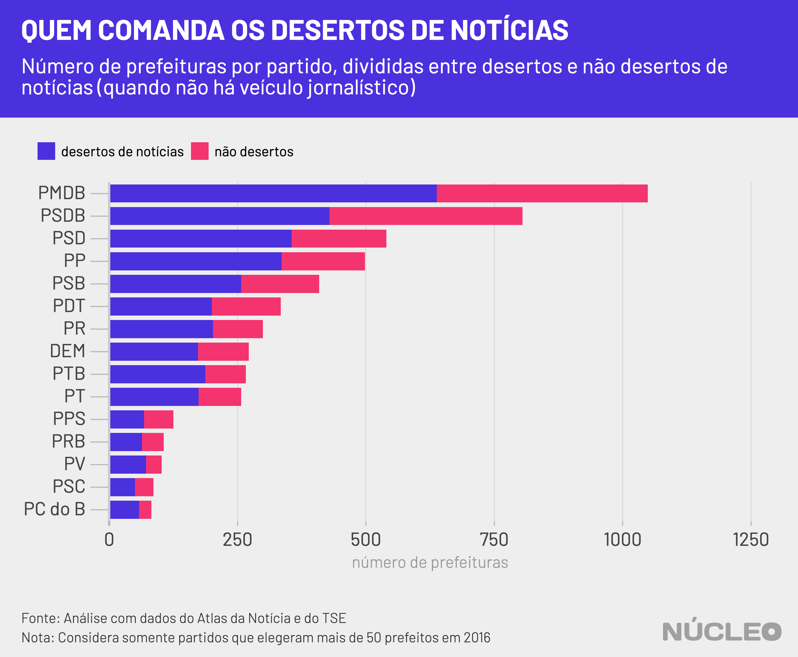

No Brasil, 62,5% dos municípios são "desertos de notícias", ou seja, lugares que não possuem veículos de jornalismo. Em qualquer ano, isso significa ausência de reportagens sobre serviços de saúde e transporte, de segurança pública, do cotidiano da cidade e, principalmente, de transparência de autoridades. Em ano de eleições, essa carência é particularmente problemática.

Análise inédita do Núcleo com dados do [Atlas da Notícia](https://www.atlas.jor.br/), projeto que mapeia o jornalismo local no Brasil, mostra quais são os partidos que controlam as prefeituras dos quase 3.500 municípios (cerca de dois terços do Brasil) que não possuem nenhum veículo para cobrir o que acontece no nível local.

---

###### É importante porque...

- *Sem jornalismo local, cidades carecem de informações que possam orientar mudanças de governo*

---

|Partido | prefeituras conquistadas em 2016 | % sobre total de prefeituras| prefeitos em desertos de notícias | % sobre total de desertos | % de desertos sobre total de prefeituras do partido |
|:-------------|-------:|---------:|----------------:|------------------:|---------:|
|PCdoB         |      82|       1,5%|               58|                1,7%|      70,7%|
|PV            |     102|       1,8%|               72|                2,1%|      70,6%|
|PTB           |     266|       4,8%|              187|                5,4%|      70,3%|
|PT            |     257|       4,6%|              174|                5,0%|      67,7%|
|PR            |     299|       5,4%|              202|                5,8%|      67,6%|
|PP            |     498|       9,0%|              336|                9,7%|      67,5%|
|PSD           |     540|       9,7%|              355|               10,2%|      65,7%|
|DEM           |     272|       4,9%|              173|                5,0%|      63,6%|
|PSB           |     409|       7,4%|              257|                7,4%|      62,8%|
|PMDB          |   1,049|      18,9%|              638|               18,3%|      60,8%|
|PRB           |     106|       1,9%|               64|                1,8%|      60,4%|
|PDT           |     334|       6,0%|              200|                5,8%|      59,9%|
|PSC           |      86|       1,5%|               50|                1,4%|      58,1%|
|PPS           |     125|       2,2%|               68|                2,0%|      54,4%|
|PSDB          |     805|      14,5%|              429|               12,3%|      53,3%|

##### O Atlas da Notícia tem pesquisadores que mapeiam veículos de jornalismo em todo Brasil.

A primeira coisa a ser notada é que, sem muitas surpresas, a proporção total dos partidos no Brasil é basicamente a mesma nos desertos de notícia. Por exemplo: o PMDB controla 1.049 prefeituras (18,9% do total de municípios), sendo 638 deles sem cobertura jornalística (18,3% do total de desertos).

Essa constatação é importante porque mostra uma correlação direta: os partidos que mais elegeram prefeitos são também aqueles que dominam, em números absolutos, mais locais onde não há cobertura jornalística, e, consequentemente, são mais carentes de informações podem levar a mudanças.

Outra coisa que precisa ser notada são os partidos que, proporcionalmente, possuem mais desertos de notícias dentro de sua própria base de prefeituras. Se o total de desertos representa 62,5% dos municípios brasileiros, todos os partidos acima desse percentual estão mais concentrados em cidades sem jornalismo local -- de certa forma, são dependentes dessas cidades.

Apesar de os desertos de notícias representarem quase dois terços dos municípios, eles abrangem apenas 18% da população (cerca de 37 milhões de habitantes). Isso porque essas cidades são, em geral, pequenas, com uma média de 11 mil habitantes.

| REGIÃO       | Nº CIDADES  | Nº DESERTOS  | PROPORÇÃO |
|--------------|-------------|--------------|-----------|
| Centro-Oeste | 467         | 183          | 39,2%     |
| Nordeste     | 1.794       | 1.318        | 73,5%     |
| Norte        | 450         | 323          | 71,8%     |
| Sudeste      | 1.668       | 1.010        | 60,6%     |
| Sul          | 1.191       | 653          | 54,8%     |

#### - [Acesse todas as estatísticas do Atlas da Notícia](https://www.atlas.jor.br/plataforma/estatisticas/)

---

###### Na imprensa

* [Pesquisa mostra aumento dos 'desertos de notícias'](https://cbn.globoradio.globo.com/media/audio/286662/pesquisa-mostra-aumento-dos-desertos-de-noticias.htm) &sdot; *CBN* &sdot; (28/12/2019)

* [Em ano de eleições, 62% das cidades brasileiras não terão cobertura de jornalismo local](https://politica.estadao.com.br/noticias/geral,em-ano-de-eleicoes-62-das-cidades-brasileiras-nao-terao-cobertura-de-jornalismo-local,70003122042) &sdot; *O Estado de S.Paulo* &sdot; (11/12/2019)

* [Brasil vê mídia digital crescer e 331 veículos jornalísticos serem extintos](https://www.poder360.com.br/midia/brasil-ve-midia-digital-crescer-e-331-veiculos-jornalisticos-serem-extintos/) &sdot; *Poder360* &sdot; (11/12/2019)

* [Pesquisa aponta 62,6% das cidades brasileiras como ‘desertos de notícias’](https://www1.folha.uol.com.br/mercado/2019/12/pesquisa-aponta-626-das-cidades-brasileiras-como-desertos-de-noticias.shtml) &sdot; *Folha de S.Paulo* &sdot; 10/11/2019)

---

### METODOLOGIA

O Núcleo cruzou dados do Atlas da Notícia com informações sobre prefeitos eleitos no Brasil, obtidas por meio do [pacote](https://github.com/Cepesp-Fgv/cepesp-r) Cepesp R, desenvolvido pela Fundação Getúlio Vargas.

Os dados veículos no Brasil são abertos, inclusive por [uma API](https://www.atlas.jor.br/plataforma/). O código da análise pode ser encontrado [neste link](https://gist.github.com/voltdatalab/96c3f537e14eb50d241eaedca13dee6c). *Nota: o autor desta análise é um dos coordenadores do Atlas da Notícia.*

O Atlas da Notícia é inspirado no projeto [America’s Growing News Deserts](https://www.cjr.org/local_news/american-news-deserts-donuts-local.php), da revista Columbia Journalism Review, que mapeou a presença de jornais nos Estados Unidos em meio às mudanças no modelo de negócios do jornalismo que levaram ao fechamento de diversos veículos.
