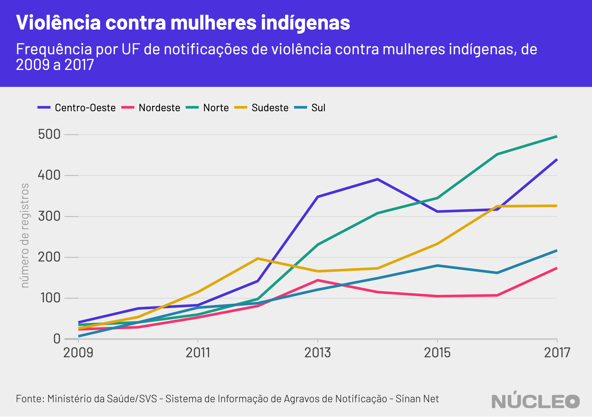

Uma marca na coxa direita é a cicatriz que Rosália (nome fictício), uma mulher indígena de 30 anos, da etnia Karajá, carrega após ter sido agredida pelo marido, com quem ficou casada durante dois anos. Eram frequentes as brigas que terminavam em chutes, pontapés, puxões de cabelo e xingamentos. Moradora da Ilha do Bananal, localizada no estado do Tocantins e separada do Mato Grosso pelo rio Araguaia, Rosália está há muitos quilômetros de distância dos serviços que poderiam tê-la ajudado a sair do ciclo de violência.

Além dos motivos que toda mulher que sofre violência enfrenta para denunciar a agressão, como o medo, vergonha e falta de acolhimento, as mulheres indígenas ainda enfrentam a desinformação sobre seus direitos, barreiras do idioma e grandes distâncias para chegar até a delegacia e pontos de atendimento mais próximos.

---

###### É importante porque...

- *É óbvio, mas vamos lá: violência contra todas as mulheres precisa acabar, e as leis precisam ajudar as pessoas*

- *Dificuldades enfrentadas por mulheres indígenas prejudicam histórico de uma lei que poderia ser mais acionada*

- *A denúncia costuma ser o último estágio para a resolução do conflito, pois a maioria das comunidades tenta resolver o problema internamente. Logo, se não é utilizada, o último recurso é continuar sofrendo abusos fora do poder da lei*

---

Rosália não denunciou o marido por medo de represálias, mas conseguiu colocar um ponto final às agressões depois que tomou coragem para terminar o relacionamento e recebeu apoio da família, que disse para ela voltar para casa. “Ele queria saber o meu passado, sobre outros namorados e quando descobria alguma coisa me batia muito, de pancada, de porrada, já me furou com um garfo. Mas nunca denunciei porque ele dizia que se fosse preso, quando saísse, me mataria”, conta. 

Rosália é um retrato do perfil das mulheres indígenas vítimas de violência, cujos dados são agregados pelo Sistema de Informação de Agravos de Notificação (Sinan), do Ministério da Saúde.

###### Entre 2007 e 2017, foram registradas 8.221 notificações de casos de violência contra mulheres indígenas. Em um terço deles, o agressor é uma pessoa próxima, como o ex ou atual companheiro. 

O espancamento e a ameaça são os principais formas de agressão e a residência é o local onde a maioria dos casos acontece, sendo as mulheres de 10 a 19 anos a maioria das vítimas. Os dados do Sinan foram compilados e divulgados Secretaria Especial de Saúde Indígena (Sesai), órgão ligado ao Ministério da Saúde.

Referência no Brasil quando o assunto é violência contra a mulher indígena, Léia do Vale Rodrigues, do povo Wapichana, explica que a situação de vulnerabilidade frente a violência da mulher indígena é resultado do escasso conhecimento da legislação, tanto por parte das mulheres como por parte dos seus agressores e comunidades, o que impede, muitas vezes, a procura pela Lei Maria da Penha.

##### [Leia mais: Aplicativo Penhas combate violência contra a mulher](https://azmina.com.br/penhas/)

### Carro, barco e caminhada para denunciar

Os Karajás são habitantes seculares das margens do rio Araguaia nos estados de Goiás, Tocantins e Mato Grosso, o que torna as águas um componente importante do deslocamento das pessoas que vivem em suas aldeias. Dependendo da localidade, é preciso enfrentar horas de viagem e mais de um tipo de meio de transporte para ir de um lugar a outro.

Num contexto de violência doméstica, essas distâncias tornam as mulheres indígenas mais vulneráveis. “Aí a gente denuncia, volta para a aldeia sem saber se medidas de proteção vão funcionar, e apanha mais, por isso que as mulheres têm medo”, conta Mariquinha Karajá, 59, que sofreu agressão do marido por anos. 

Ela não denunciou o marido pelas agressões, que só pararam porque ele morreu. “Ele me batia porque quando bebia criava coisas na cabeça dele de que eu o estava traindo. Ele não me machucava porque eu conseguia correr. Até com arma de fogo eu fui ameaçada. Foi assim a vida toda, até ele morrer”, conta.

Caso Mariquinha quisesse denunciar as agressões, teria que usar três meios de transporte: motorizado, barco e as próprias pernas. Isso porque a delegacia mais próxima fica no município de São Félix do Araguaia, no Mato Grosso – ou seja, em outro estado. 

Para sair da aldeia onde vive seria necessário enfrentar pelo menos uma hora de solavancos em uma caminhonete por uma estrada de terra, que em dias de chuva fica intransitável, para chegar ao porto. Para isso, dependeria ainda que houvesse um veículo de algum órgão público disponível, o que pode demorar dias para acontecer. No porto, teria que desembolsar de R$ 80 a R$ 100 (ida e volta) aos barqueiros para uma travessia de dez minutos pelo rio e depois caminhar algumas centenas de metros até a delegacia. 

Após registrar a denúncia, ela ainda seria encaminhada para o município de Lagoa da Confusão, no Tocantins, área de jurisdição das aldeias Karajá. Essa cidade fica ainda mais distante da aldeia, o que aumentaria a dificuldade para se conseguir uma medida protetiva, se fosse necessária. 

A denúncia costuma ser o último estágio para a resolução do conflito, pois a maioria das comunidades tenta resolver o problema internamente, segundo Telma Taurepang, da coordenação da União das Mulheres Indígenas da Amazônia Brasileira (Umiab). A partir da denúncia recebida, cabe à Funai (Fundação Nacional do Índio) acompanhar a entrada da Polícia Federal em territórios indígenas. 

De acordo com a delegada Ana Caroline Terra, de São Félix do Araguaia, o Ministério Público Federal do Tocantins promoveu uma audiência pública em outubro de 2019 com autoridades do Mato Grosso para discutir uma cooperação para um melhor atendimento à população indígena que vive na Ilha do Bananal. No entanto, o acordo ainda não foi formalizado.

<figcaption>Telma Taurepang, da coordenação da União das Mulheres Indígenas da Amazônia Brasileira – Umiab (Foto: Maria Fernanda Ribeiro)</figcaption>

Barreira linguística
Além da distância, há também a barreira do idioma para muitas das mulheres indígenas. Mariquinha, por exemplo, não fala português fluente. Apesar da longa convivência com a sociedade não-indígena, a etnia Karajá conseguiu manter costumes tradicionais, como sua língua nativa. 

A falta de informações sobre seus direitos e sobre a Lei Maria da Penha muitas vezes estão ligadas a questão do idioma, mas também a questões culturais. Para o diálogo ser efetivo é necessário respeitar as especificidades de cada povo, seja com o uso de termos que se aproximam mais da realidade daquela comunidade a contos que envolvem a mitologia de determinada etnia, explica Nara Baré, a primeira mulher a ser eleita para a Coordenação das Organizações Indígenas da Amazônia Brasileira (Coiab).

De acordo com Censo IBGE 2010, no Brasil são faladas 274 línguas indígenas. Cerca de 17,5% da população indígena não fala a língua portuguesa. A população indígena brasileira soma 897 mil pessoas de de 305 etnias, sendo 448 mil mulheres (50%). 

Para aproximar as mulheres indígenas dos seus direitos, o Núcleo Institucional de Promoção e Defesa dos Direitos da Mulher (Nudem) da Defensoria Pública do Estado do Mato Grosso do Sul traduziu a Lei Maria da Penha para as línguas guarani e terena e confeccionou cartilhas com informações sobre violência contra a mulher. A defensora pública Thaís Dominato Silva Teixeira conta que o material foi produzido após um evento com mulheres indígenas, realizado em 2015.

“Após escutá-las, constatamos que o que faltava era informação. Elas contaram que tinham vontade de denunciar, mas não sabiam como a Lei Maria da Penha funcionava. Como já tínhamos a cartilha em português, pensamos: então vamos traduzir”, afirma a defensora. Os exemplares são utilizados em eventos e distribuídos nas aldeias. 

O serviços de atendimento à mulheres vítimas de violência também precisam considerar a questão do idioma. Quando foi inaugurada em Campo Grande, capital do Mato Grosso do Sul, a Casa da Mulher Brasileira contava com com a presença de duas tradutoras indígenas para as línguas guarani e terena, as duas maiores etnias no estado. “É diferente você chegar lá e se deparar com uma parente sua, que pode conversar com você. Isso é acolher e encoraja a mulher”, diz Silvana Terena, secretária de Políticas Públicas para a população indígena do Mato Grosso do Sul. Mas em 2017, dois anos após a inauguração, os contratos não foram renovados e desde então o atendimento está sem tradução. 

<figcaption>Mulheres Karajá (Foto: Maria Fernanda Ribeiro)</figcaption>

A Casa da Mulher Brasileira reúne serviços de atendimento a mulheres vítimas de violência e foi criada em 2013 pela ex-presidente Dilma Rousseff, no âmbito do programa Mulher: Viver sem Violência. Deveria ser implementada em todos os 26 estados e o Distrito Federal até o fim de 2018, mas só chegou a sete estados: São Paulo, Brasília, Ceará, Paraná, Maranhão, Mato Grosso do Sul e Roraima. A reportagem procurou o Ministério da Mulher, da Família e dos Direitos Humanos, por meio de sua assessoria de imprensa, mas não foi atendida. 

O [Manual de Atuação em Casos de Feminicídio](https://www.cnmp.mp.br/portal/images/Publicacoes/documentos/2019/MANUAL_JUSTI%C3%87A_FEMINICIDIO_19.11.pdf), recém-lançado pelo Conselho Nacional do Ministério Público, traz duas menções às mulheres indígenas em suas 38 páginas. A única orientação que faz é o seguinte: “Quando a vítima for indígena, se for o caso, pedir o auxílio da Polícia Federal. Lembrar sempre que, em vários Estados, os grupos indígenas vivem em situação de maior vulnerabilidade, sendo que as mulheres indígenas, por conta da barreira da língua e das questões culturais, têm maior dificuldade de acesso às autoridades para conseguirem sair do ciclo de violência.”

### Jornada para conscientização 

A forma como a Lei Maria da Penha pode ser aplicada dentro das aldeias tem sido tema presente nos encontros de mulheres indígenas. Foi um dos assuntos abordados durante o Encontro da Associação Indígenas Vale do Araguaia (Asiva), que ocorreu em novembro de 2019, na aldeia Fontoura, na Ilha do Bananal. O encontro reuniu cerca de cem mulheres vindas de diferentes aldeias. Homens também foram convidados e acolhidos nos debates.

De acordo com Eliane Karajá, responsável pela coordenação do encontro, conversar sobre o assunto, explicar sobre a Lei Maria da Penha e envolver também os homens na discussão é uma das alternativas para conscientizar e levar as informações sobre direitos e deveres para dentro das aldeias.

<figcaption>Eliane Karajá, coordenadora do Encontro da Associação Indígenas Vale do Araguaia (Foto: Maria Fernanda)</figcaption>

O trabalho mais extenso já realizado no país sobre isso, inclusive, é fruto do trabalho de uma mulher índigena. Léia do Vale Rodrigues, do povo Wapichana, encabeçou as ações da Fundação Nacional do Índio (Funai) entre 2008 e 2010 para levar informações sobre a Lei Maria da Penha para homens e mulheres indígenas. 

Em dois anos, foram 13 seminários e 452 mulheres envolvidas, de norte a sul do país, tendo em vista os direitos especiais dos povos indígenas garantidos tanto na Constituição Federal quanto em instrumentos internacionais. Com a pergunta “Quais e como tem sido tratada a questão da violência em sua comunidade?”, foram recolhidos relatos sobre as agressões recebidas ou testemunhadas pelas participantes. 

Para ela, se faz necessário levar às comunidades a discussão sobre as possibilidades de articulação entre a lei e o direito próprio dos povos indígenas, respeitando os valores e entendimentos de cada povo. “Se a visão de mundo deste sujeito coletivo não é levada em conta, também se produz uma violação dos direitos individuais”, afirma Léia, que foi exonerada pelo atual governo Jair Bolsonaro do cargo de coordenadora-geral de Promoção da Cidadania da Funai. 

### Violência ainda é tabu

Segundo Nara Baré,apesar de ser um tema presente nos encontros e mobilizações, falar sobre a violência ainda é um tabu, seja para as indígenas que vivem nas aldeias, seja para as de recente contato ou até mesmo para as que estão em contexto urbanos.

“É um momento muito íntimo e pode não ser confortável para todas elas. Temos muito cuidado em lidar com essas temáticas, com uma metodologia que elas possam entender e se abrir conosco para que a gente ajude sem ferir a individualidade e a política interna daquela comunidade”, explica Nara. 

Cristiane Julião, do povo Pankararu, representante do estado do Pernambuco no programa Voz das Mulheres Indígena da Organização das Nações Unidas (ONU), afirma que romper tais barreiras é um processo e que a dificuldade pode estar relacionada devido à naturalização de algumas práticas e pela maneira como a mulher indígena foi, e ainda é percebida e tratada – de maneira que pode tanto vulgarizar como silenciar. 

“Discutir o assunto é importante para desconstruir a banalização das violências contra as indígenas e também para que reconheçamos quais são as nossas tradições políticas, sociais e jurídicas próprias”, afirma Cristiane. 

### Cultura e o papel da mulher indígena

Ao falar sobre o tema, é comum ouvir o argumento de que as agressões à mulher “faz parte da cultura indígena” – uma forma de banalização da violência contra a mulher muito comum também entre não indígenas. Mas Telma Taurepang, da coordenação da União das Mulheres Indígenas da Amazônia Brasileira (Umiab), refuta a tese de que a violência seja intrínseca à cultura indígena. 

“Cultural é a mulher estar à frente no roçado, é produzir a agricultura familiar, e não apanhar ou sofrer violências psicológicas”, diz. Telma conta que o tema é frequentemente levado para as reuniões e que a meta é mostrar para essas mulheres que elas têm voz e que podem sair dessa situação. 

A questão passa também pelos papéis desempenhados pela mulher dentro da comunidade. De acordo com Sandra Kuady, recém-eleita a primeira mulher cacique da aldeia São Domingos, a maior comunidade Karajá, muitos homens ainda pensam que o papel da mulher é o de cozinhar, o de cuidar da casa, dos filhos e não conseguem lidar com a realidade de que nem todas desejam desempenhar tais funções. 

“Temos sabedoria suficiente para administrar e ajudar o nosso povo, mas muitas mulheres sofrem com isso. E também tem o problema da bebida, que é uma triste realidade e afeta demais as famílias. Aqui tem muito xingamento, tapa na cara e temos que denunciar para que esse homem, que agride, seja preso. Para reduzir essa violência é preciso diálogo em todas as instâncias”, diz Sandra 

### O diálogo com os homens

Dentro do Movimento das Mulheres Indígenas do Xingu, a dificuldade é romper a barreira com os homens, segundo a liderança Watatakalu Yawalapiti. “Muito difícil fazer com que as pessoas entendam que quando a gente fala de violência, não estamos falando de brigar entre nós, mas sim que queremos conversar sobre o problema”, conta. “Falar sobre pessoas que bebem e são violentos dentro de casa. E, para isso, tem que ter muita conversa e mostrar que se a mulher tá bem, a família vai estar bem porque quando uma mulher é violentada a comunidade toda é afetada.”

Criar mecanismos próprios para solucionar os casos de violência doméstica é o que um grupo de homens, liderado pelo cacique Izael Morales, tem feito na Reserva Indígena de Dourados, no Mato Grosso do Sul. Juntos, eles ajudam as mulheres a romperem o silêncio e incentivam a denúncia dos agressores. Izael conta que na maioria das vezes quem busca o grupo não é a vítima, mas sim uma amiga ou parente próxima. A partir daí, eles vão até a casa da mulher que está sofrendo a violência e iniciam um diálogo com ela e com o agressor, que geralmente é o marido. 

“A maioria dos casos é por uso de bebida e, se precisar, tiramos esse homem de dentro da casa para proteger a mulher. Nós explicamos para a mulher sobre a Lei Maria da Penha, da importância de denunciar, das medidas protetivas e nós mesmos a levamos até a delegacia”, disse o cacique.

*Essa reportagem foi produzida pela Bolsa de Reportagem AzMina 2019 em parceria com o Volt Data Lab*

### METODOLOGIA

Essa matéria foi produzida a partir do [concurso de bolsas de reportagem](https://azmina.com.br/reportagens/azmina-lanca-bolsas-de-reportagem-sobre-violencia-domestica/) da _Revista Azmina_, em parceria com o [*Volt Data Lab*](www.voltdata.info), para a qual a repórter Maria Fernanda Ribeiro [foi selecionada](https://azmina.com.br/reportagens/selecionadas-para-as-bolsas-de-reportagem-azmina/).

A metodologia aqui descrita foi solicitada pelo **Núcleo** diretamente para a repórter e não consta na reportagem originalmente publicada no site da _Revista Azmina_.

Segundo a repórter, ela ficou procurando um lugar para captar as imagens e as entrevistas. Boa parte das entrevistas foi feita por telefone, após contato com pessoas do movimento indígena, avisando sobre bolsa e pedindo dicas de lugares. A repórter acompanha o movimento das mulheres indígenas e da floresta há algunas anos, e soube que aconteceria o Encontro da Associação Indígenas Vale do Araguaia (Asiva) em novembro de 2019.

A repórter estão se deslocou para a [Ilha do Bananal](https://pt.wikipedia.org/wiki/Ilha_do_Bananal), no Estado do Tocantins, e ficou lá por quatro dias acompanhando a reunião, a qual tratou de vários assuntos, entre eles a violência doméstica. Foram quase 10 dias de viagem, considerando o traslado.

A ideia da pauta, segundo a repórter, surgiu na [primeira marcha](https://g1.globo.com/df/distrito-federal/noticia/2019/08/11/liderancas-se-reunem-em-brasilia-para-1a-marcha-das-mulheres-indigenas.ghtml) das mulheres indígenas ocorrida em agosto, em Brasília, na qual foi questionada a eficácia Lei Maria da Penha para essas mulheres.   

Os dados da reportagem foram obtidos pela repórter junto à assessoria de imprensa do Ministério da Saúde.

O gráfico nessa publicação do **Núcleo** não consta na reportagem original e foi produzido com dados do [Tabnet - Datasus](http://tabnet.datasus.gov.br/).
