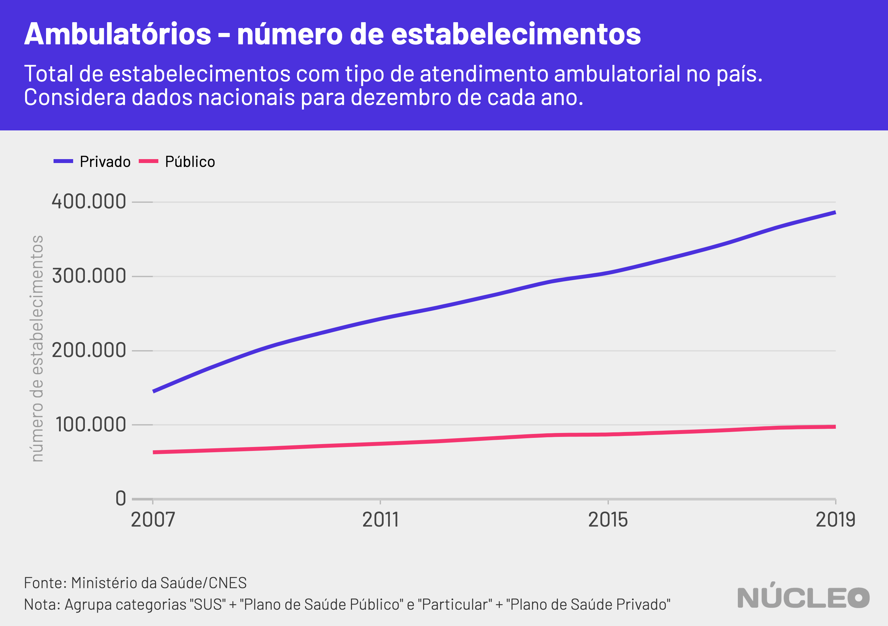
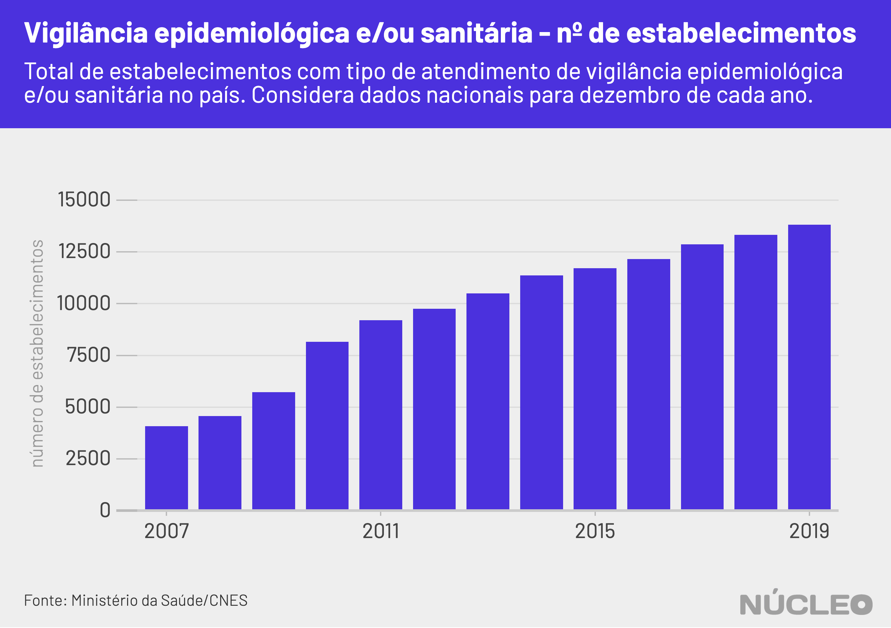

Com a iminência da epidemia de [COVID-19](https://www.paho.org/bra/index.php?option=com_content&view=article&id=6101:folha-informativa-novo-coronavirus-2019-ncov&Itemid=875) no Brasil, a capacidade hospitalar e ambulatorial no país tem sido cada vez mais discutida. No fim do ano passado, antes das notícias sobre o coronavírus se espalharem, o Conselho Federal de Medicina [já havia alertado](https://www.amib.org.br/noticia/nid/cfm-alerta-falta-de-financiamento-impacta-no-numero-de-leitos-e-prejudica-trabalho-medico/) para uma queda no número de leitos hospitalares.

O **Núcleo** foi atrás de dados do Cadastro Nacional de Estabelecimentos de Saúde (CNES), [disponibilizados](http://www2.datasus.gov.br/DATASUS/index.php?area=0204) pelo Ministério da Saúde, para entender o estado da capacidade de atendimento de unidades de saúde brasileiras.

Sobre o número de leitos disponíveis, um dos indicadores mais discutidos recentemente, foi constatada uma queda total (considerando SUS e não SUS) de 6,2% no número de leitos de internação regulares desde 2007 até fim de 2019, totalizando 28.300 unidades. A conta não considera leitos complementares (UTI e unidades intermediárias).

---

###### É importante porque...

- *A epidemia de coronavírus deve testar limites do sistema de saúde brasileiro*

- *Caso a epidemia se espalhe pelo Brasil, podem faltar leitos*

- *SUS é o principal sistema de saúde do país*

---

#### [Folha informativa da OPAS – novo coronavírus (COVID-19)](https://www.paho.org/bra/index.php?option=com_content&view=article&id=6101:folha-informativa-novo-coronavirus-2019-ncov&Itemid=875)

No entanto, essa queda foi principalmente puxada pelo Sistema Único de Saúde, principal recurso de saúde pública brasileiro, onde houve uma redução de oferta de 14,3% (49 mil leitos) desde 2007, ao passo que a oferta de leitos fora do SUS teve acréscimo de 18,2%.  

O motivo da queda no número de leitos em geral acontece porque, embora o setor privado tenha apresentado substancial crescimento, o SUS possui muito mais leitos disponíveis.

<i class="far fa-hand-pointer"></i> <small><em>Clique nos botões para trocar o gráfico</em></small>

  <button class="active botao" onclick="changeimg('../img/capacidade-hospitalar/nucleo_internacao_sus.png',this);">Internação - SUS
  </button>
  <button class="botao" onclick="changeimg('../img/capacidade-hospitalar/nucleo_internacao_naosus.png',this);">Internação - Não SUS
  </button>
  <button class="botao" onclick="changeimg('../img/capacidade-hospitalar/nucleo_internacao_total.png',this);">Internação - Total
</button>

  

    
  

A seriedade acerca da capacidade de leitos é reassegurada por especialistas. Segundo a Associação de Medicina Intensiva Brasileira (AMIB):

> Durante uma situação em que a demanda de doentes críticos ultrapassa a nossa capacidade de atendimento constitui-se uma situação de desastre. Nesta situação excepcional definida e reconhecida pelas autoridades de saúde e outros, será necessário ampliar a capacidade de atendimento de vítimas graves.

A entidade [preparou](https://www.amib.org.br/fileadmin/user_upload/Aumento.Capacidade.COVID19.Versao10.03.pdf) um documento destacando as principais questões a serem consideradas em caso de um peso maior sobre o sistema de tratamento intensivo no país.

Se considerarmos apenas _leitos complementares_ (UTIs e Unidades Intermediárias), houve aumento total (SUS e não SUS) de 83% na oferta desses leitos, sendo 58% no SUS. O **Núcleo** considerou apenas _leitos de internação_ nessa conta, seguindo [estudo](https://portal.cfm.org.br/index.php?option=com_content&view=article&id=27721:2018-07-12-14-05-59&catid=3) do Conselho Federal de Medicina.

---

###### Na imprensa

* [Coronavírus acende alerta sobre preparo de hospitais no Brasil para tratar infectados graves](https://brasil.elpais.com/brasil/2020-03-12/coronavirus-acende-alerta-sobre-preparo-de-hospitais-no-brasil-para-tratar-infectados-graves.html) &sdot; *El País* &sdot; (11/03/2020)

* [Ministério da Saúde alerta hospitais sobre pico do coronavírus](https://www.bbc.com/portuguese/geral-51736012) &sdot; *BBC Brasil* &sdot; (11/03/2020)

* [10 boas notícias sobre o coronavírus em meio a "pandemia de medo"](https://saude.gov.br/noticias/agencia-saude/46249-novo-coronavirus-veja-lista-de-hospitais-que-serao-referencia-no-brasil) &sdot; *Ministério da Saúde* &sdot; (30/01/2020)

* [Novo coronavírus: veja lista de hospitais que serão referência no Brasil](https://saude.gov.br/noticias/agencia-saude/46249-novo-coronavirus-veja-lista-de-hospitais-que-serao-referencia-no-brasil) &sdot; *Ministério da Saúde* &sdot; (30/01/2020)

---

### CAPACIDADE DE ATENDIMENTO

Embora o número total de leitos tenha caído desde 2007, a quantidade de *estabelecimentos* que oferecem esses leitos no Brasil cresceu -- sejam essas unidades que disponham de recursos de ambulatório ou de internação.

Note a diferença entre a oferta geral de *leitos*, que caiu por conta do SUS, e o montante de *estabelecimentos* que oferecem leitos.

A capacidade ambulatorial brasileira mais do que dobrou nos últimos anos, de 60,2 mil unidades ao fim de 2007 para 155,6 mil em 2019.

O país também aumentou o número de estabelecimentos de vigilância de epidemias ao longo dos anos, de 4.000 em dezembro de 2007 para 13.800 unidades em dezembro de 2019.

### METODOLOGIA

O **Núcleo** recorreu a dados do Ministério da Saúde, no [sistema Tabnet](http://www2.datasus.gov.br/DATASUS/index.php?area=0204), do Datasus. Foram analisados dados agregados para todo o país do Cadastro Nacional de Estabelecimentos de Saúde (CNES) relativos a:

- **Estabelecimentos**: nas rubricas "_Tipo de Atendimento Prestado - Ambulatório_", "_Tipo de Atendimento Prestado - Internação_" e "_Tipo de Atendimento Prestado - Vigilância Epidemiológica e/ou Sanitária_".

- **Recursos físicos**: na rubrica "_Hospitalar - Leitos Internação_".

Segundo [nota técnica](http://tabnet.datasus.gov.br/cgi/cnes/NT_RecursosF%C3%ADsicos.htm) do Tabnet, _leitos de internação_ consideram leitos em "ambientes hospitalares, nas categorias de leitos cirúrgicos, clínicos, obstétricos, pediátricos, hospital dia e outras especialidades, na quantidade existente e na disponibilizada para atendimento pelo SUS e atendimento Não SUS. São as camas destinadas à internação de um paciente no hospital. Não considera como leito hospitalar os leitos de observação."

Há também a categioria de _leitos complementares_, que são "leitos em ambientes hospitalares, nas categorias de leitos complementares (UTI e Unidade Intermediária), na quantidade existente e na disponibilizada para atendimento pelo SUS e atendimento Não SUS."

Por termos feito apenas uma descrição dos dados encontrados, sem fazer juízos, o **Núcleo** não entrou em contato com o governo para pedir esclarecimentos. Se governo, organizações ou pessoas desejarem enviar algum esclarecimento acerca desses dados, favor contatar os editores no email [nucleo@voltdata.info](mailto:nucleo@voltdata.info).

