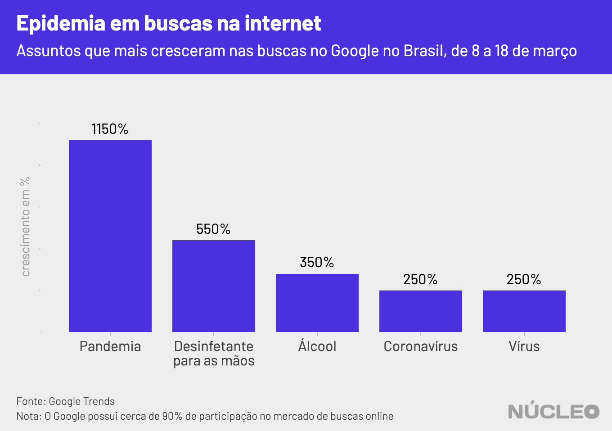

A pandemia do novo coronavírus no Brasil começou a ganhar predominância nas redes sociais a partir de notícias sobre a contaminação de autoridades brasileiras, no fim da semana passada, quando representantes do governo federal começaram a ser testados e diagnosticados com COVID-19.

Esse pode ser um indicativo de como as autoridades brasileiras estavam lidando com o caso, sem reconhecer publicamente sua devida gravidade, o que foi refletido na discussão nas redes sociais, que demorou para conhecer a dimensão do problema no país, mesmo com o agravamento da situação em todo mundo, especialmente na China e na Itália.

---

###### É importante porque...

- *O assunto tem dominado as discussões em redes sociais, à medida que medidas mais drásticas são tomadas para conter o vírus*

- *Boa parte das autoridades se comunica com suas bases pelo Twitter, que se tornou um lugar de discussão política e de assuntos do momento*

---

#### [Acesse aqui dados em tempo real sobre a pandemia - via Johns Hopkins University](https://coronavirus.jhu.edu/map.html?fbclid=IwAR3e_CRbLWn8AcfGIyS_owIO1CXiCBUgjFXe7MnjxKoDEaSKm7P5ss_0uko)

Até quinta-feira, 12 de março, quando o secretário de comunicação do governo, Fabio Wajngarten, [testou positivo](https://veja.abril.com.br/politica/secretario-testa-positivo-para-coronavirus-bolsonaro-e-monitorado/) para o vírus, o assunto não havia chegado aos [trending topics](https://help.twitter.com/pt/using-twitter/twitter-trending-faqs) da rede social, de acordo com dados levantados pelo **Núcleo** no site [Trendogate](https://trendogate.com/), que cataloga os 50 assuntos mais populares todos os dias, inclusive no Brasil (embora sem mostrar o número total de tuítes).

O Núcleo também analisou 1,03 milhões de tuítes de 9 a 19 de março e constatou que o assunto ganhou notoriedade essa semana, chegando a mais de 150 mil tuítes únicos por dia com os termos "coronavírus" e "COVID-19" em português no Brasil, desconsiderando retuítes e respostas.

Embora o Twitter não divulgue dados específicos por país, é possível dizer que 150 mil tuítes é um número significativo. O Brasil é o 5º maior mercado do Twitter no mundo, com 12,15 milhões de usuários.  

Apenas como comparativo, as hashtags "#ProvaLider" e "#provaderesistencia" relacionadas ao reality show Big Brother Brasil, um dos assuntos que vinham movimentando o Twitter brasileiro antes da crise, haviam gerado, conjuntamente, cerca de 125 mil tuítes até 14h10 desta sexta-feira, 20 de março. Já o tópico "Dia 5", relacionado ao isolamento social forçado pelo COVID-19, possuía 154 mil tuítes no mesmo horário.

Esses 1,03 milhão de tuítes geraram 7,5 milhões de retuítes e 34,2 milhões de curtidas. Abaixo, o tuíte com mais compartilhamentos registrados no período.

 

<blockquote class="twitter-tweet" data-dnt="true">
meu deus fizeram um remix da cardi b falando coronavírus <a href="https://t.co/9ykMvrwMfw">pic.twitter.com/9ykMvrwMfw</a>
&mdash; alysson villalba (@alysvillalba) <a href="https://twitter.com/alysvillalba/status/1238559688972738561?ref_src=twsrc%5Etfw">March 13, 2020</a></blockquote> 

 

No Google, o assunto também começou a disparar a partir de 8 de março. O termo "pandemia", por exemplo, cresceu 1.150% em 10 dias.

<ul class="timeline">

	<!-- Item 1 -->
	<li>
		

			

				O secretário
				12 de março
			

			
Secretário de comunicação do governo, Fabio Wajngarten, teste positivo para COVID-19

		

	</li>

	<!-- Item 2 -->
	<li>
		

			

				O presidente
				13 de março
			

			
Pela manhã, muita ansiedade no noticiário sobre diagnóstico de Jair Bolsonaro

		

	</li>

	<!-- Item 3 -->
	<li>
		

			

				A manifestação
				15 de março
			

			
Presidente cumprimenta manifestantes e é criticado por estar sob suspeita de infecção

		

	</li>

	<!-- Item 4 -->
	<li>
		

			

			Políticas públicas
			16 de março
			

			
Governos estaduais, municipais e federal anunciam medidas mais duras para combate à epidemia

		

	</li>

	<!-- Item 5 -->
	<li>
		

			

				Em pauta
				17 de março
			

			
Coronavírus continua forte no Twitter e na imprensa, com panelaço antecipado contra Bolsonaro

		

	</li>

<!-- Item 6 -->
<li>
	

		

		O panelaço
		18 de março
		

		
Diversas cidades brasileiras realizam panelaço contra Bolsonaro

	

</li>

</ul>

---

###### Na imprensa

* [Bolsonaro é antepenúltimo em ranking de tuítes de presidentes sobre coronavírus](https://www1.folha.uol.com.br/poder/2020/03/bolsonaro-e-antepenultimo-em-ranking-de-tuites-de-presidentes-sobre-coronavirus.shtml) &sdot; *Folha de S.Paulo* &sdot; (18/03/2020)

* [Coronavírus: Facebook, Google, Twitter e Microsoft se unem contra fake news](https://www.uol.com.br/tilt/noticias/bloomberg/2020/03/17/gigantes-da-tecnologia-se-unem-contra-fake-news-do-coronavirus.htm) &sdot; *UOL* &sdot; (17/03/2020)

* [Twitter removerá publicações que estimulam a propagação do coronavírus](https://olhardigital.com.br/coronavirus/noticia/twitter-removera-publicacoes-que-estimulam-a-propagacao-do-coronavirus/98283) &sdot; *Olhar Digital* &sdot; (19/03/2020)

---

### METODOLOGIA

O **Núcleo** capturou 1.034.973 tuítes das 20h50 do dia 9 de março até 3h19 do dia 19, utilizando a API gratuita do Twitter. Os códigos podem ser [encontrados aqui](https://gist.github.com/voltdatalab/a342c1179284deafa5c508dad33373f5).

A conta considera _apenas_ tuítes únicos, ou seja, exclui retuítes e respostas a tuítes. Isso porque queremos medir a espontaneidade de publicações sobre o tema, não a reação (comentários e compartilhamentos). Por isso o número pode parecer mais modesto, mas na verdade é bem substancial.

Com a finalidade de manter a privacidade de usuários com perfis pouco notórios, o **Núcleo** não vai divulgar os dados brutos -- cada pessoa pode rodar o código de extração para obter esses resultados.

Os dados sobre trending topics foram obtidos manualmente via [Trendogate](https://trendogate.com/), que cataloga os 50 assuntos mais populares por dia na rede social, por país.

O **Núcleo** entrou em contato com o Twitter via email em busca de estatísticas agregadas pela própria plataforma, no Brasil. A plataforma respondeu apenas as duas informações abaixo, sem discriminação por país:

>  - No período de 9 a 19 de março foram contabilizados 409,3 milhões Tweets no mundo sobre o COVID-19
 - No período de 16 a 18 de março foram contabilizados 154,4 milhões Tweets no mundo sobre o COVID-19
