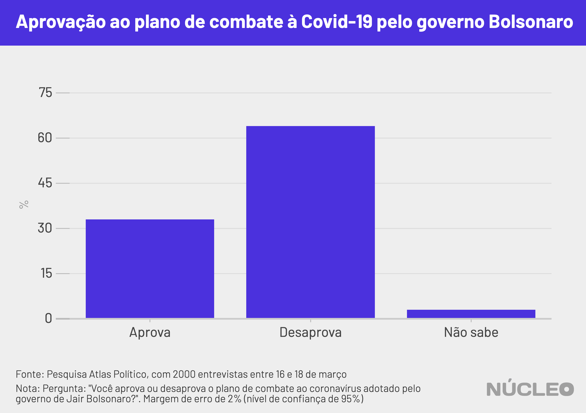

Na contramão de outros líderes mundiais, Jair Bolsonaro não conseguiu melhorar a avaliação de seu governo durante a crise da epidemia de coronavírus, em um momento no qual o presidente tem adotado uma postura contrária a políticas de isolamento social recomendadas pela Organização Mundial da Saúde e apoiadas pela população.

Com a exceção do Brasil, em todos os outros países analisados pelo Núcleo (Chile, EUA, Itália, França, Grã-Bretanha, Portugal e Peru) os presidentes ou primeiros-ministros observaram crescimento nos índices relacionados à avaliação do seu trabalho ou governo após o início do combate à COVID-19.

---

###### É importante porque...

- *Indica quão popular são as posições tomadas por Bolsonaro durante a crise do coronavírus*

- *2020 é ano eleitoral e presidente pode perder poder de endossar candidatos*

---

Em pesquisas conduzidas pela [Quaest](http://quaest.com.br/) Pesquisa & Consultoria, a aprovação da administração do presidente Jair Bolsonaro caiu de 52 para 46 pontos percentuais (no limite da margem de erro) entre as duas pesquisas realizadas em março. Já a não-aprovação oscilou de 47 para 51 pontos percentuais. Neste mesmo período, o sentimento de "preocupação" em relação ao futuro do país cresceu de 61 para 72 pontos percentuais, segundo os respondentes.

O levantamento mais recente foi realizado entre os dias 19 e 23 de março -- ou seja, iniciado um dia após a entrevista coletiva do presidente e seus ministros para [anunciar medidas](https://g1.globo.com/jornal-nacional/noticia/2020/03/18/bolsonaro-reune-ministros-e-anuncia-medidas-para-a-crise-da-covid-19.ghtml) de combate à COVID-19 e encerrando no dia em que foi editada (e parcialmente revogada) a medida provisória que [permitia](https://economia.uol.com.br/noticias/redacao/2020/03/23/mp-governo-bolsonaro-contrato-de-trabalho-coronavirus.htm) a suspensão dos contratos de trabalho por até quatro meses.

Na figura abaixo, estão as séries históricas de pesquisas de opinião nacionais relacionadas ao desempenho dos governos de cada país analisado. Note que os percentuais não podem ser comparados diretamente, pois as pesquisas variam entre países (para mais informações, ver a nossa seção de "Metodologia").

<i class="far fa-hand-pointer"></i> <small><em>Clique nos botões para trocar o gráfico</em></small>

  <button class="active botao" onclick="changeimg('../img/bolsonaro-aprovacao/avaliacao_Brasil_nome.png',this);">Brasil
  </button>
  <button class="botao" onclick="changeimg('../img/bolsonaro-aprovacao/avaliacao_Chile_pais.png',this);">Chile
  </button>
  <button class="botao" onclick="changeimg('../img/bolsonaro-aprovacao/avaliacao_EUA_pais.png',this);">EUA
  </button>
  <button class="botao" onclick="changeimg('../img/bolsonaro-aprovacao/avaliacao_Franca_pais.png',this);">França
  </button>
  <button class="botao" onclick="changeimg('../img/bolsonaro-aprovacao/avaliacao_GB_pais.png',this);">Grã-Bretanha
  </button>
  <button class="botao" onclick="changeimg('../img/bolsonaro-aprovacao/avaliacao_Italia_pais.png',this);">Itália
  </button>
  <button class="botao" onclick="changeimg('../img/bolsonaro-aprovacao/avaliacao_Portugal_pais.png',this);">Portugal
  </button>

  

    
  

##### Em outros países, presidentes e primeiros-ministros se beneficiaram de medidas tomadas para contenção dos efeitos da COVID-19.

* Na Itália, à época o país epicentro da doença, o Instituto Ixè [registrou](https://www.istitutoixe.it/2020/03/24/gli-italiani-e-il-coronavirus-24-marzo/) um aumento de 9 pontos percentuais na confiança da população em relação ao primeiro-ministro Giuseppe Conte entre os dias 10 e 24 de março.

* No Chile, apesar da má avaliação que o presidente Sebastián Piñera acumula desde os protestos do ano passado, entre pesquisas que se encerraram no dia 13 de março e 27 de março, a aprovação do presidente registrou crescimento de 9 pontos percentuais, saindo de 12% para 21%, segundo pesquisa Cadem/Plaza Pública.

* Na Grã-Bretanha, pesquisa Ipsos-Mori já detectava um movimento de crescimento da satisfação dos eleitores com o primeiro-ministro Boris Johnson, saltando de 47% para 52% entre o início de fevereiro e o meio de março. Em pesquisas mais recentes, entre os dias 18 e 23 de março, o YouGov [detectou](https://yougov.co.uk/topics/politics/articles-reports/2020/03/24/coronavirus-reaction-pushes-pms-popularity-positiv) um aumento de 12 pontos percentuais em opiniões favoráveis ao primeiro-ministro.

* Mesmo nos Estados Unidos, onde as respostas do governo Trump à crise oscilaram nas últimas semanas, a aprovação presidencial vem apresentando [aumento](https://projects.fivethirtyeight.com/trump-approval-ratings/), ainda que [leve](https://twitter.com/RachelBitecofer/status/1243532991453892610).

* No Peru, pesquisa Ipsos em áreas urbanas [apontou](https://www.ipsos.com/es-pe/encuesta-de-opinion-cuarentena-covid-19k) que o presidente Martín Vizcarra atingiu 87% de aprovação em pesquisa feita em 20 e 21 de março. Na pesquisa anterior (com amostra representativa para todo o país, portanto diferente da pesquisa mais recente), a aprovação era 35 pontos percentuais mais baixa (52%).

### ENROLAR-SE NA BANDEIRA

Segundo [diversos](https://fivethirtyeight.com/features/trumps-reelection-may-hinge-on-the-economy-and-coronavirus/) (outra referência [aqui](https://www.bloomberg.com/opinion/articles/2020-03-28/coronavirus-gives-boris-johnson-s-political-immunity)) analistas, isso pode [estar](https://www1.folha.uol.com.br/colunas/marcus-melo/2020/03/razoes-da-desordem.shtml) relacionado ao que a ciência política [denomina](https://www.theguardian.com/news/datablog/2020/jan/04/trump-iran-suleimani-president-approval-ratings) "efeito de união nacional" (ou _rally around the flag_, em inglês): o aumento da popularidade de líderes políticos em momentos de crises nacionais. Em sua formulação original, essa teoria argumenta que em eventos internacionais, nos quais a atuação do presidente é exigida e que são dramáticos e claramente identificáveis o presidente dos Estados Unidos poderia se beneficiar de súbitos (e curtos) [aumentos](https://www.jstor.org/stable/1955610) de popularidade presidencial, devido a uma união nacional em torno do líder.

Desde então, a ciência política documenta a observação deste efeito em diversos países do mundo, [principalmente](https://journals.sagepub.com/doi/10.1177/1354068809346073) em eventos de guerra ou terrorismo. Há registros também deste efeito em [casos](https://ceciliahmo.files.wordpress.com/2020/03/can_natural_disasters_have_a_rallyeffect.pdf) de eventos naturais  (como após um terremoto em 2015 no Nepal), inclusive em nível subnacional (como argumentam os autores [deste artigo](https://journals.sagepub.com/doi/abs/10.1177/0010414019858959) sobre o efeito em eleições municipais após incêndios acidentais na Espanha), ainda que a literatura não seja consensual neste ponto.

##### Por que o governo Bolsonaro não parece capaz de se beneficiar deste efeito?

Uma possível resposta estaria nas respostas dos governos (e a avaliação da população a eles). Nesta mesma amostra de países, foram coletados dados sobre como os cidadãos vêem a ação dos respectivos governos nacionais.

No levantamento da Quaest Consultoria e Pesquisa anteriormente citado, 52% dos entrevistados disseram que Bolsonaro estava lidando "mal" ou "muito mal" com a crise do coronavírus, enquanto 41% avaliavam "bem" ou "muito bem" a [atuação do presidente](https://www.itatiaia.com.br/noticia/maioria-dos-brasileiros-considera-pandemia-de) (7% não responderam disseram que não sabem). De acordo com [pesquisa](http://atlaspolitico.com.br/downloads/Atlas_BR_031820.pdf) conduzida pela consultoria Atlas Político entre 16 e 18 de março, 64% da população brasileira desaprova o plano de combate ao coronavírus adotado pelo presidente, enquanto somente 33% o aprovam.

A situação difere em outros países. No Chile, pesquisa Plaza Pública-Cadem que foi a campo entre 18 e 20 de março apontou que a população se divide quanto a sua gestão da crise: na pesquisa mais recente, 43% da população avaliou a gestão bem ou muito bem, enquanto 48% a avaliaram mal ou muito mal. Além disso, os índices vêm crescendo: na pesquisa anterior, de 16 de março, somente 36% a avaliavam como bem ou muito bem.

Em [pesquisa](https://www.kantar.com/Inspiration/Coronavirus/Seven-in-ten-in-G7-say-personal-income-has-or-will-be-affected-by-coronavirus) realizada pela Kantar em países do G7 entre os dias 19 e 21 de março, o governo japonês foi o único que não atingiu o patamar de 50% de respondentes aprovando a maneira como os governos estão respondendo à crise.

Em Portugal, uma pesquisa ICS/ISCTE feita entre 20 e 22 de março apontou que cerca de 75% da população afirma ter alguma ou muita confiança nas [respostas](https://sondagens-ics-ul.iscte-iul.pt/wp-content/uploads/2020/03/Sondagem-ICS_ISCTE_Mar%C3%A7o2020_Covid.pdf) dadas pelo primeiro-ministro. E, no Peru, pesquisa Ipsos apontou que 83% dos residentes em áreas urbanas aprovam o [desempenho](https://www.ipsos.com/es-pe/encuesta-de-opinion-cuarentena-covid-19) do governo frente à crise.

### METODOLOGIA

O Núcleo buscou pesquisas de opinião divulgadas publicamente em países da América do Sul, Europa Ocidental e Estados Unidos que aferissem a avaliação da opinião pública sobre os chefes de Estado ou seus governos, em uma série histórica, e que houvessem conduzido tais pesquisas após o início da crise e tomadas de medidas em combate a Covid-19.

O foco desta análise foi identificar a consistência destas medidas de opinião pública ao longo dos últimos meses de 2019 e primeiros meses de 2020. Apesar das perguntas variarem entre as pesquisas (como apontado na matéria), agrupamos as respostas em três categorias: “positivo”, “negativo” e “outros”, para indicar a direção em que a opinião pública se direcionava ao presidente/governo. Abaixo, encontra-se uma tabela com a categorização realizada:

| Categoria de resposta     | Categorização Núcleo |
|---------------------------|----------------------|
| Aprova                    | Positivo             |
| Confia                    | Positivo             |
| Favorável                 | Positivo             |
| Satisfeito                | Positivo             |
| Desfavorável              | Negativo             |
| Insatisfeito              | Negativo             |
| Não aprova                | Negativo             |
| Não confia                | Negativo             |
| Não respondeu             | Outros               |
| Não sabe                  | Outros               |
| Sem opinião               | Outros               |
| Não aprova, nem desaprova | Outros               |

Para a mesma amostra de países, buscamos pesquisas de opinião que aferissem como as populações locais avaliaram as respostas dos governos e líderes à crise.

Sobre o "efeito de união nacional": Roberto Ramos e Carlos Sanz apontam [em artigo](https://journals.sagepub.com/doi/abs/10.1177/0010414019858959) sobre os incêndios naturais na Espanha, que "ao se olhar para um único desastre, uma resposta particularmente boa ou ruim do incumbente ou um choque concomitante (por exemplo, econômico) pode afetar resultados eleitorais".

Em estudo sobre este efeito em disputas militares para o caso norte-americano, William Baker e John Oneal [argumentam](https://journals.sagepub.com/doi/10.1177/0022002701045005006) que "o que parece importar mais para o tamanho do efeito não é a própria natureza da disputa mas quão efetivamente a Casa Branca gerencia a apresentação da disputa por meio de declarações do presidente, cobertura da imprensa e a obtenção de apoio bipartidário."

Os códigos da análise estão disponíveis [neste link](https://gist.github.com/lgelape/7022068fe55e18c7a100cfceb01a70d9).

