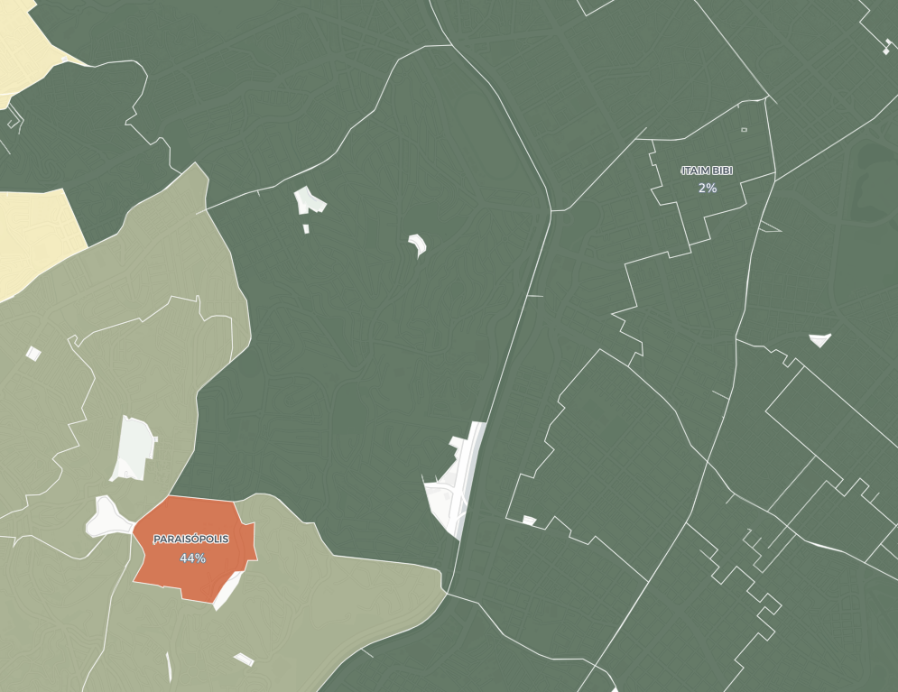
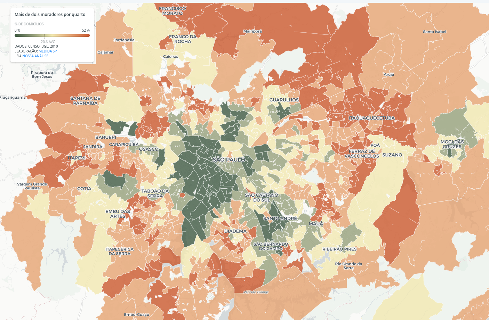
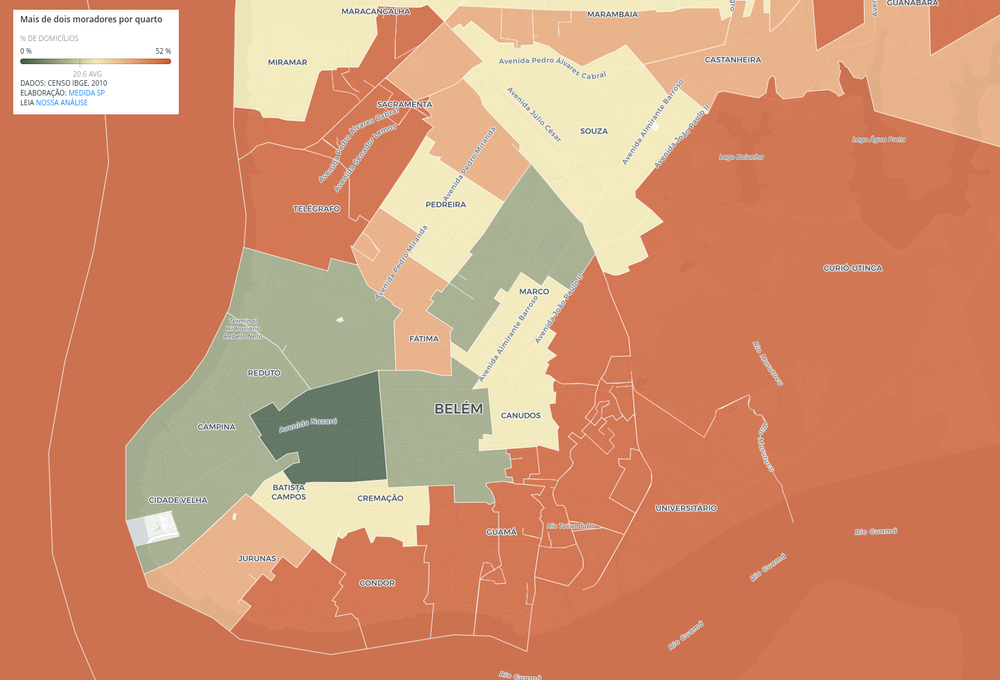

Nas regiões metropolitanas do Brasil, há um padrão geográfico claro: casas na periferia tendem a ter mais moradores por quarto do que as casas mais centrais.

Usando dados do Censo 2010, mapeamos o percentual de domicílios com mais de dois moradores por dormitório. O resultado não é exatamente surpreendente, mas revela mais um dos abismos entre periferia e centro nas metrópoles brasileiras.

Enquanto no Itaim Bibi, em São Paulo, só 2% dos domicílios tem mais de duas pessoas por quarto, em Paraisópolis esse número é de 44%. Se considerarmos o corte como mais de três pessoas por quarto, são 19% dos domicílios em Paraisópolis nessa condição.

---

###### É importante porque...

- *Mostra a dificuldade prática na política de isolamento social nas periferias, para combate ao coronavírus*

- *Em domicílios com muitos moradores por quarto, pode ser praticamente impossível adotar medidas de isolamento caso algum morador apresente sintomas do coronavírus*

---

<figcaption>Itaim Bibi (canto superior direito) tem só 2% dos domicílios com mais de duas pessoas por quarto; em Paraisópolis (em vermelho), são 44% dos domicílios</figcaption>

No Itaim Palista, bairro na zona leste paulistana, cerca de 32% dos domicílios têm mais de dois moradores por quarto. Esse padrão de diferença entre centro e periferia é observado em toda a Região Metropolitanta de São Paulo.

<figcaption>A disparidade entre centro e periferia na RMSP. As áreas vermelhas são as que possuem maior porcentagem de domicílios com mais de dois moradores por quarto</figcaption>

Usando esses dados, podemos estimar que pelo menos 25% dos moradores da Região Metropolitana de São Paulo vivem em domicílios com mais de duas pessoas por dormitório.

### O que isso significa para as medidas de isolamento

Em domicílios com muitos moradores por quarto, pode ser praticamente impossível adotar medidas de isolamento caso algum morador apresente sintomas do coronavírus, ou seja de um grupo de risco. Esse ponto se soma a uma longa lista de fatores que podem colocar as periferias em risco, como já têm [alertado](https://www.nexojornal.com.br/expresso/2020/03/18/Por-que-as-periferias-s%C3%A3o-mais-vulner%C3%A1veis-ao-coronav%C3%ADrus) [especialistas](https://www1.folha.uol.com.br/colunas/perifaconnection/2020/03/o-coronavirus-mata-mas-a-desigualdade-social-acelera-o-obito.shtml), incluindo falta de água e saneamento básico.

##### Esse dado reforça o argumento de que a melhor maneira de reduzir a expansão do coronavírus é através do isolamento horizontal, no qual todos deveriam ficar isolados, como defendem a OMS e [muitos](https://brasil.elpais.com/brasil/2020-03-25/isolamento-vertical-proposto-por-bolsonaro-pode-acelerar-contagios-por-coronavirus-e-comprometer-sistema-de-saude.html) [especialistas](https://apublica.org/2020/03/isolamento-vertical-se-mostrou-ineficaz-e-arriscado-em-outros-paises-diz-medica-da-fiocruz/).

O oposto é o [isolamento vertical](https://www1.folha.uol.com.br/equilibrioesaude/2020/03/isolamento-vertical-contra-coronavirus-depende-de-rastreamento-e-testes-amplos.shtml), que recomenda isolar apenas alguns grupos específicos, posição que vem sendo defendida pelo presidente Jair Bolsonaro nos seus pronunciamentos.

Entretanto, o que os dados acima mostram é que fazer isolamento vertical seria impraticável para boa parte das periferias devido a características das suas moradias, com muitas pessoas para poucos quartos. Assim, o isolamento vertical traria mais danos sobretudo para as populações que já são as mais vulneráveis nas metrópoles.

### Outras cidades

Já no Rio de Janeiro, a Barra da Tijuca também possui só 2% de seus domicílios com mais de duas pessoas por dormitório, enquanto na Rocinha esse número é de cerca de 38%.

<figcaption>Na esquerda, a Barra da Tijuca, com 2% de domicílios com mais de duas pessoas por quarto; na direita, a Rocinha, com 38%</figcaption>

<figcaption>A região metropolitana do Rio de Janeiro</figcaption>

Em Belém, no bairro do Barreiro, cerca de 52% dos domicílios tem mais de duas pessoas por dormitório.

<figcaption>Belém do Pará</figcaption>

Esse padrão de disparidade entre centro e periferia se repete em todas a regiões metropolitanas do Brasil que analisamos, com diferentes graus de intensidade. O mapa interativo abaixo permite visualizar esse fenômeno.

Momentos como o que estamos vivendo atualmente revelam a importância de termos dados demográficos atualizados para planejamento, políticas públicas, e situações de crise (o Censo 2010 é o mais recente disponível; [veja mais sobre o adiamento do Censo que seria realizado neste ano](https://g1.globo.com/economia/noticia/2020/03/17/censo-e-adiado-para-2021.ghtml)).

Mais do que nunca precisamos de políticas sendo feitas baseadas em evidências para reduzir os danos causados por essa pandemia.

### METODOLOGIA

Utilizamos os dados do Censo 2010 nesta análise, tanto do questionário geral quanto do questionário da amostra. O questionário da amostra é um questionário expandido e é aplicado só em uma amostra dos domicílios. Nos microdados desse questionário há tanto o número de habitantes quanto de dormitórios por domicílio. O número de habitantes por quarto é uma divisão dessas duas variáveis.

Como esse questionário é feito por amostragem, ele tem uma área geográfica maior do que os setores censitários (a unidade de recenseamento do IBGE). Essas áreas são chamadas de “áreas de ponderação”. Uma tabela disponibilizada pelo IBGE permite cruzar as as áreas de ponderação com os setores censitários.

Para calcular o percentual de moradores na Região Metropolitana de SP que vivem em domicílios com mais de duas pessoas por quarto, multiplicamos o número de moradores dentro de cada área de ponderação (extraído a partir da junção com os setores censitários) pela porcentagem de pessoas vivendo nessas condições.

Vale ressaltar que esse número é provavelmente subestimado, uma vez que os domicílios mais densos devem concentrar uma parcela ainda maior da população das suas áreas de ponderação, justamente por serem mais densos. Em breve publicaremos o código completo da análise aqui.

