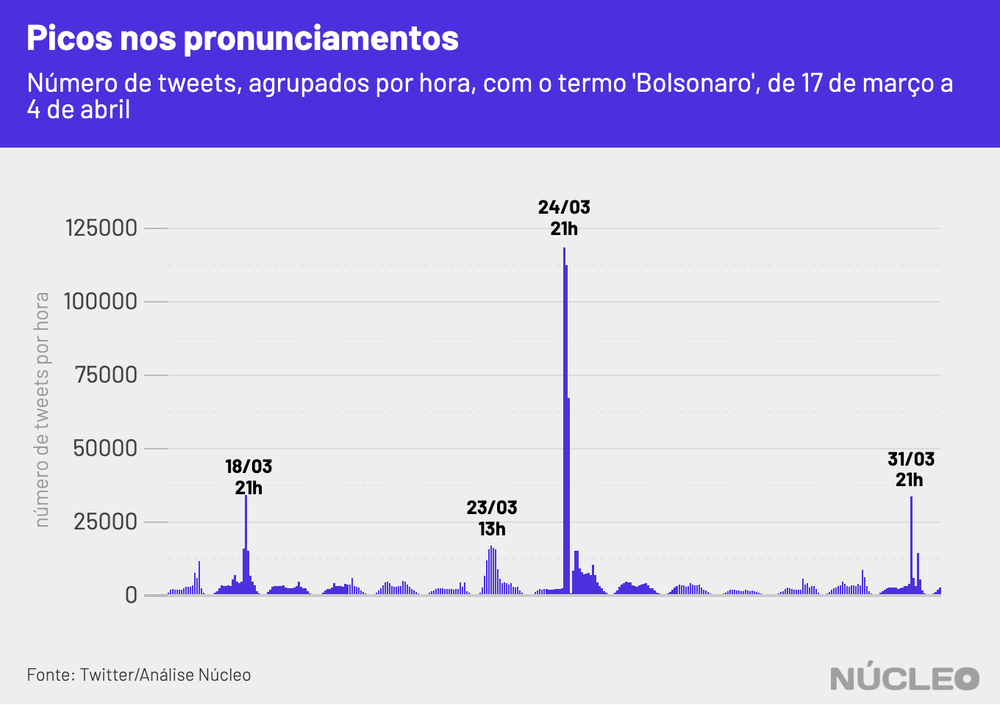

A ativa e engajada base de apoiadores de Jair Bolsonaro no Twitter foi soterrada nas últimas duas semanas por uma avalanche de críticas a ele ou aos seus filhos, e à sua postura em relação à epidemia de coronavírus no Brasil, deixando ao presidente um saldo predominantemente negativo na rede social, um dos principais canais de comunicação aberta que o ajudaram a se eleger em 2018.

O **Núcleo** captou e analisou 1,27 milhão de tweets únicos (exclui RTs e comentários) com o termo 'Bolsonaro' ou hashtags relacionadas a ele, de 17 de março a 4 de abril. Essas publicações geraram um total de 50,3 milhões de interações (curtidas e retweets).

---

###### É importante porque...

- *Mostra a dificuldade prática na política de isolamento social nas periferias, para combate ao coronavírus*

- *Em domicílios com muitos moradores por quarto, pode ser praticamente impossível adotar medidas de isolamento caso algum morador apresente sintomas do coronavírus*

---

Para conseguirmos ter uma ideia do saldo de popularidade, analisamos, um a um, os 1.000 tweets com mais interações nessa base, a fim de avaliar como as publicações com maior repercussão se posicionavam em relação a Bolsonaro.

O peso desse recorte é significante: apesar de representar apenas 0,08% do total de tweets analisados, esse milheiro corresponde a 45,5% (22,85 milhões) de todas as interações apuradas.

Nos tweets com mais engajamento, Bolsonaro tem perdido significativamente: 71% de todas as interações foram realizadas em tweets negativos ao presidente, ao passo que apenas 20,5% foram positivas. O restante foi considerado neutro. Vale ressaltar que o Twitter é a rede na qual a oposição parece [mais crescer](http://observademocraciadigital.org/posts/twitter-e-a-rede-em-que-os-parlamentares-de-partidos-situados-no-grupo-de-centro-alcancaram-maior-protagonismo-no-debate-sobre-o-covid-19/), de acordo com relatório de março da FGV/DAPP.

Isso não quer dizer que a base de apoiadores de Bolsonaro seja pequena ou pouco engajada, mas que seus críticos conseguiram superar seus defensores na última quinzena no mês.

Essa proporção pode ser claramente observada no gráfico abaixo. O engajamento (número interações dividido pelo número de tweets), em geral, é bem superior nos tweets desfavoráveis a Bolsonaro nesse período.

O Brasil tem 12,15 milhões de usuários de Twitter, [de acordo com](https://www.statista.com/statistics/977791/number-twitter-users-in-latin-american-countries/) o site Statista. Embora a base seja pequena em comparação à população brasileira, ela motiva boa parte do engajamento político e do noticiário nas redes. Segundo a consultoria Arquimedes, [até ajuda](https://www1.folha.uol.com.br/poder/2020/02/nas-crises-bolsonaro-se-orienta-pelas-redes-sociais-para-manter-sua-base-coesa.shtml) Bolsonaro a direcionar suas ações.

Bolsonaro tem sido um crítico de políticas de isolamento social adotadas por governadores e prefeitos para o combate ao coronavírus, indo contra recomendações da Organização Mundial da Saúde e até mesmo de seu próprio Ministério da Saúde.

O Youtuber Felipe Neto foi quem mais, individualmente, produziu engajamento nessa lista: 19 de seus tweets geraram mais de dois milhões de likes e compartilhamentos combinados. Dentre as 10 contas com mais interações, seis produziram tweets majoritariamente desfavoráveis a Bolsonaro, três foram mais favoráveis e uma é neutra.

| nome            | nº de tweets        | total interações  |
|-----------------|---------------------|-------------------|
| [felipeneto](https://twitter.com/search?q=Bolsonaro%20from%3Afelipeneto&src=typed_query)      | 19                  | 2.022.299         |
| [GuilhermeBoulos](https://twitter.com/search?q=Bolsonaro%20from%3AGuilhermeBoulos&src=typed_query) | 26                  | 550.936           |
| [folha](https://twitter.com/search?q=Bolsonaro%20from%3Afolha&src=typed_query)           | 28                  | 513.244           |
| [MarceloFreixo](https://twitter.com/search?q=Bolsonaro%20from%3AMarceloFreixo&src=typed_query)   | 25                  | 512.875           |
| [Haddad_Fernando](https://twitter.com/search?q=Bolsonaro%20from%3AHaddad_Fernando&src=typed_query) | 13                  | 502.319           |
| [HaddadDebochado](https://twitter.com/search?q=Bolsonaro%20from%3AHaddadDebochado&src=typed_query) | 22                  | 469.688           |
| [Bolsoneas](https://twitter.com/search?q=Bolsonaro%20from%3ABolsoneas&src=typed_query)       | 15                  | 335.745           |
| [leandroruschel](https://twitter.com/search?q=Bolsonaro%20from%3Aleandroruschel&src=typed_query)  | 19                  | 327.164           |
| [monicabergamo](https://twitter.com/search?q=Bolsonaro%20from%3Amonicabergamo&src=typed_query)   | 16                  | 323.683           |
| [taoquei1](https://twitter.com/search?q=Bolsonaro%20from%3Ataoquei1&src=typed_query)        | 17                  | 321.427           |

### PRONUNCIAMENTOS

O primeiro pronunciamento oficial de Jair Bolsonaro na TV, em [24 de março](https://www.youtube.com/watch?v=Vl_DYb-XaAE), no qual ele chamou a COVID-19 de "gripezinha" e instou a governadores e prefeitos para que encerrassem políticas de isolamento social, gerou quase o que o dobro do engajamento no Twitter do que o discurso mais ameno realizado pelo presidente [uma semana depois](https://www.youtube.com/watch?v=16RR2rG_AKA), o que indica um desgaste com a postura combativa do presidente sobre o coronavírus.  

Isso indica que o discurso do presidente, indo contra o consenso de especialistas para recomendações de saúde, inflamou bastante a polarização e as críticas a ele.

No dia 18 de março, outro pico, foi a coletiva de imprensa com diversos ministros, todos [utilizando máscaras](https://www.youtube.com/watch?v=lhltNqinvm4). Cinco dias depois, em 23 de março, [foram anunciadas](https://www.youtube.com/watch?v=Kv4bU88WPzc) novas ações de enfrentamento à epidemia.

### DESINFORMAÇÃO

<small><em>[Essa seção é creditada ao Aos Fatos]</em></small>

Insular e com menos espaço nas redes, a base de apoio virtual do presidente Jair Bolsonaro tem recorrido a publicações virais que disseminam desinformação para defender a política de isolamento vertical, anunciar a eficácia ainda não comprovada da hidroxicloroquina no tratamento de Covid-19 e criticar o Congresso e os governadores. É o que mostra uma análise conduzida pelo [Radar Aos Fatos](https://aosfatos.org/radar/) com os dados do **Núcleo**.

Neste universo, foram analisadas as 50 postagens com mais interações (curtidas e compartilhamentos) que se mostravam favoráveis ou desfavoráveis ao presidente. A conclusão é que, dentre os 50 tweets mais populares que partiram em defesa de Bolsonaro, nove continham informações falsas ou distorcidas; quatro deles postados por parlamentares ou integrantes do governo.

Na lista de publicações contrárias ao presidente, constam parlamentares e políticos como como o ex-candidato à Presidência da República Fernando Haddad (PT), mas Aos Fatos não encontrou nenhum tipo de desinformação. A grande maioria dessas postagens tinha viés opinativo — e em alguns casos, um tom humorístico —, que não são checáveis, segundo a [metodologia](https://aosfatos.org/nosso-m%C3%A9todo/) do Aos Fatos.

Entre os parlamentares que se manifestaram favoravelmente no Twitter, o destaque é o deputado federal e filho do presidente, Eduardo Bolsonaro (PSL-SP). Cinco de suas publicações integraram a lista de 50 tweets mais populares, com um total de 169 mil interações. Ele foi também o que mais disseminou desinformação: duas de suas postagens continham distorções ou informações factualmente insustentáveis.

Um exemplo é um tweet do dia 18 de março e que somou 46.716 interações no qual o deputado compartilha um vídeo com três notícias: a primeira é uma [crítica](https://g1.globo.com/politica/noticia/2020/03/15/alcolumbre-critica-estimulos-a-aglomeracao-de-pessoas-nas-ruas-apos-bolsonaro-participar-de-ato.ghtml) do presidente do Senado, Davi Alcolumbre (DEM-AP), ao fato de Jair Bolsonaro ter desrespeitado medidas de isolamento ao sair para cumprimentar apoiadores durante manifestação do dia 15 de março. A segunda é uma imagem do senador festa de lançamento da CNN Brasil, realizada em São Paulo no dia 9 de março. A última afirma que o parlamentar havia [contraído Covid-19](https://www12.senado.leg.br/noticias/materias/2020/03/18/presidente-davi-alcolumbre-testa-positivo-para-covid-19).

---

###### Na imprensa

* [Coronavírus: Projetos do Congresso para combater fake news buscam penalizar redes sociais, diz estudo](https://oglobo.globo.com/brasil/coronavirus-projetos-do-congresso-para-combater-fake-news-buscam-penalizar-redes-sociais-diz-estudo-24355327) &sdot; *O Globo* &sdot; (07/04/2020)

* [Coronavírus: governadores são principais rivais de Bolsonaro nas redes, diz levantamento](https://www.bbc.com/portuguese/brasil-52192736) &sdot; *BBC Brasil* &sdot; (06/04/2020)

* [Direita 'racha' sobre Mandetta no Twitter, após crítica pública de Bolsonaro](https://www1.folha.uol.com.br/poder/2020/04/direita-racha-sobre-mandetta-no-twitter-apos-critica-publica-de-bolsonaro.shtml) &sdot; *Folha de S.Paulo* &sdot; (03/03/2020)

* [‘Panelaço virtual’ superou manifestações de apoio a Bolsonaro no Twitter](https://www.poder360.com.br/midia/panelaco-virtual-superou-manifestacoes-de-apoio-a-bolsonaro-no-twitter/) &sdot; *Poder360* &sdot; (19/03/2020)

---

### METODOLOGIA

O **Núcleo** capturou 1,27 milhão tuítes das 20h50 do dia 9 de março até 3h19 do dia 19, utilizando a API gratuita do Twitter. O código para extração pode ser [encontrado aqui](https://gist.github.com/voltdatalab/a342c1179284deafa5c508dad33373f5).

Com a finalidade de manter a privacidade de usuários com perfis pouco notórios, o **Núcleo** não vai divulgar os dados brutos – cada pessoa pode rodar o código de extração para obter esses resultados.

A conta considera apenas tuítes únicos, ou seja, exclui retuítes e respostas a tuítes. Isso porque queremos medir a espontaneidade de publicações sobre o tema, não a reação (comentários e compartilhamentos).

A classificação dos tweets foi baseada no tom e intenção da mensagem, e classificada manualmente em: favorável, desfavorável ou neutro (são notícias ou descrições de notícias). Todos os 1.000 tweets foram acessados e lidos, para então serem classificados.
