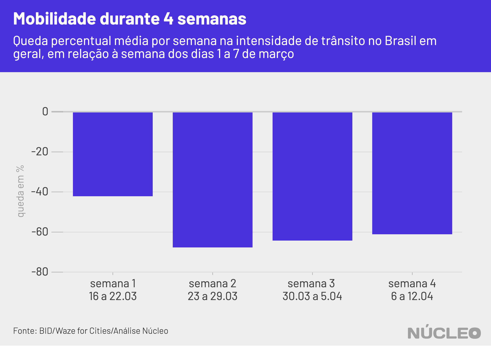

Apesar de o trânsito no Brasil ter caído mais do que pela metade no último mês, os índices de isolamento social no país ainda estão aquém do esperado por autoridades. Fins de semana têm colocado à prova metas de reclusão de governos estaduais para combate ao coronavírus, à medida que a movimentação tende a crescer aos sábados e, especialmente, aos domingos.

Em geral, o congestionamento médio de veículos no país entre 15 de março e 14 de abril apresentou queda de 60% em relação à primeira semana de março, dias 1 a 7, quando a movimentação ainda estava normal, de acordo com análise do **Núcleo** com [dados](https://www.iadb.org/en/topics-effectiveness-improving-lives/coronavirus-impact-dashboard) do com dados disponibilizados pelo Banco Interamericano de Desenvolvimento/IDB Invest.

---

###### É importante porque...

- *Mostra os efeitos da epidemia e das medidas de contenção na circulação de pessoas e veículos*

- *Indica também desafios do isolamento social*

---

No entanto, ao considerarmos semana a semana, o índice que chegou a ver redução de 68% entre 23 e 29 de março na comparação com o início do mês passado, paulatinamente caiu nas duas semanas seguintes para 61% na semana encerrada em 12 de abril.

##### Um dos principais motores desse recuo na queda do tráfego veicular é a tendência de maior circulação nas ruas durante fins de semana.

Enquanto na primeira semana efetiva de isolamento (16 a 22 de março) a reclusão estava ganhando corpo durante os dias úteis, alcançando o ápice no fim de semana, a partir da segunda semana os sábados e domingos passaram a ter maior circulação geral em relação aos dias anteriores, particularmente o último dia da semana.

Não é à toa que a movimentação média aos domingos recuou, desde 15 de março, apenas 54%, ao passo que às sextas-feiras a queda chega a quase 68%. Sábados têm um índice um pouco maior, mas se consideramos os dias imediatamente anteriores, a tendência é de queda.

| dia da semana | redução média na intensidade de trânsito |
|---------------|------------------------------------------|
| segunda       | -56.33%                                  |
| terça         | -58.41%                                  |
| quarta        | -56.25%                                  |
| quinta        | -59.69%                                  |
| sexta         | -67.69%                                  |
| sábado        | -62.48%                                  |
| domingo       | -54.42%                                  |

Os dados do BID/Waze medem a intensidade de congestionamento de trânsito (TCI, na sigla em inglês), que considera tanto a extensão do trânsito quanto sua duração em um determinado espaço. Os dados são baseados em um convênio entre o Banco Interamericano de Desenvolvimento e o programa “Waze for Cities”. A metodologia pode ser encontrada [neste documento](http://idbdocs.iadb.org/wsdocs/getdocument.aspx?docnum=EZSHARE-1350314980-529).

Averiguar a intensidade de trânsito é apenas uma das métricas para medir o isolamento social. O Google, por exemplo, também [divulga](https://www.google.com/covid19/mobility/) relatórios de mobilidade em diferentes países, [inclusive](https://www.gstatic.com/covid19/mobility/2020-04-05_BR_Mobility_Report_en.pdf) do Brasil, a partir de dados do seu serviço de mapas e navegação.

A empresa de georreferenciamento In Loco, de Recife, também publica um [índice](https://mapabrasileirodacovid.inloco.com.br/pt/) de isolamento social a partir do rastreamento anonimizado de celulares em sua base de dados.

O governo do Estado de São Paulo [estima](https://www.saopaulo.sp.gov.br/noticias-coronavirus/isolamento-social-em-sao-paulo-e-de-55-aponta-sistema-de-monitoramento-inteligente/) que a taxa de isolamento social deve ficar em 70% da população para que as medidas de contenção funcionem. No último domingo, segundo medição da administração paulista, ficou em 59%.

### METODOLOGIA

O **Núcleo** analisou os dados do BID/Waze e fez suas próprias classificações, identificado os dias da semana por nome e as semanas a partir de quando os dados começaram a ser mensurados.

A semana de 8 a 15 de março foi considerada "semana 0" e não entra na conta das análises do **Núcleo** em nenhum cenário, principalmente porque as medidas de distanciamento social começaram a ser adotadas como políticas públicas a partir da semana seguinte -- embora antes o tráfego de veículos de fato apresentasse um recuo, mesmo que modesto.

A partir disso fizemos análises de médias comparáveis a partir semana por semana e também dia por dia, a fim de saber as diferenças apresentadas nos fins de semana em relação aos dias de semana.

Foi tentada uma média móvel de semana a semana, a fim de fazer uma outra medida de tendência, mas a ideia foi descartada porque o número de semanas consideradas ainda é pequeno.

O código da análise pode ser encontrado [neste link](https://gist.github.com/voltdatalab/d76f1c41fea201c926bf141afc140dc4), na linguagem R.
