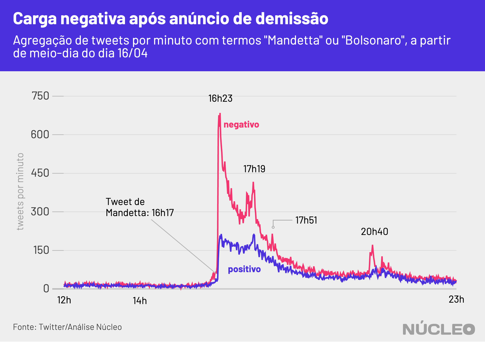
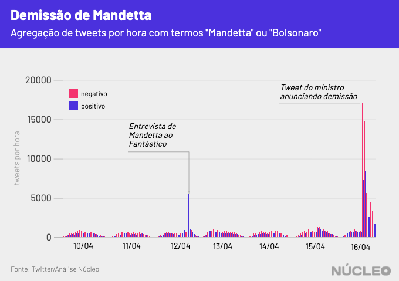
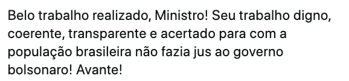

O anúncio da demissão do ministro Luiz Henrique Mandetta do Ministério da Saúde gerou um pico de reações de carga negativa no Twitter, indicando potencial contrariedade com o afastamento [forçado](https://brasil.elpais.com/sociedade/2020-04-16/mandetta-e-demitido-por-bolsonaro.html) do ministro pelo presidente Jair Bolsonaro, em meio à pandemia de coronavírus.

Análise do **Núcleo** com mais de 300 mil tweets mostra que logo após [publicação de Mandetta](https://twitter.com/lhmandetta/status/1250865863755997189) anunciando sua saída do governo há um pico de tweets negativos muito superior a positivos, continuando assim por algumas horas.

---

###### É importante porque...

- *O Twitter sempre foi importante para a comunicação de Bolsonaro, inclusive em busca de apoio. Perder a conversa lá significa enfraquecimento dele em um de seus principais canais*

- *Boa parte das autoridades se comunica com suas bases pelo Twitter, que se tornou um termômetro de discussão política e de assuntos do momento no país, pautando autoridades, imprensa e o debate em geral*

---

##### É importante salientar que a carga (**positiva** ou **negativa**) de um tweet não dita necessariamente a disposição de um tuiteiro em relação à demissão de Mandetta (contra ou a favor), mas sim traz pesos e sentimentos ao centro do debate.

Sentimentos **negativos** indicam que o debate tende a ser carregado de adjetivos e críticas pesadas, ao passo que os **positivos** refletem frequentemente um tom mais ameno e elogioso (seja a Bolsonaro ou a Mandetta, por exemplo), mas também pode representar ironias (alguém usando termos afáveis para ironizar uma posição desfavorável, por exemplo).

Publicações com carga negativa são usuais no Twitter, à medida que a rede social é reconhecidamente um lugar de crítica política e campo de batalha ideológico entre esquerda e direita, mas o que chama a atenção nesse caso é a diferença em que essa distribuição acontece logo após o tweet de Mandetta e nos momentos seguintes.

Como é possível ver no gráfico demonstrativo abaixo, em uma distribuição de tweets sem picos é possível observar que publicações com carga negativa são em geral predominantes sobre tweets positivos, mas com uma margem não muito grande.

Gráfico demonstrativo
{: .figcaption}

Mas se acrescentarmos os picos à série histórica, vemos por exemplo que a entrevista de Mandetta ao programa Fantástico, da Rede Globo, no dia 12 de abril gerou um pico de tweets com carga positiva, ao passo que o anúncio de sua demissão foi predominantemente negativo.

Com esse *spread* entre tweets negativos e positivos colocados em comparação (entrevista e anúncio) é possível notar o tom do debate na rede social e presumir que houve uma recepção majoritariamente negativa à demissão do ministro.

Note que a escala é em tweets por hora no gráfico abaixo, diferente de cima. Isso porque é mais fácil ver tweets por hora ao longo de vários dias, ao passo que num período de algumas horas o uso tweets por minuto permite ver melhor as nuances.

As [divergências](https://oglobo.globo.com/brasil/bolsonaro-diz-que-divergencia-com-mandetta-cada-vez-mais-se-tornava-uma-realidade-1-24376367) entre Bolsonaro e Mandetta estavam evidentes há dias, principalmente pela predominância que o ex-ministro vinha ganhando no combate ao coronavírus, mas também pela discordância do presidente em relação à posição de Mandetta nos esforços para conter o avanço do vírus.

Bolsonaro defende medidas mais amenas de movimentação de pessoas, a fim de evitar um colapso na economia, ao passo que Mandetta, com respaldo da comunidade científica e da Organização Mundial da Saúde (OMS) defende isolamento social mais intenso, com menor circulação de pessoas na ruas. Segundo pesquisa do Datafolha, [cerca de dois terços](https://www1.folha.uol.com.br/poder/2020/04/demissao-de-mandetta-por-bolsonaro-e-reprovada-por-64-diz-datafolha.shtml) dos brasileiros reprovaram a demissão de Mandetta.

### TIPOS DE TWEETS

_Os autores dos tweets foram mantidos anônimos_

- Positivo em geral

- Negativo em geral

- Positividade irônica

---

###### Na imprensa

* [Mandetta foi de 'grande exemplo' a 'traidor' para a direita no Twitter](https://www1.folha.uol.com.br/poder/2020/04/mandetta-foi-de-grande-exemplo-a-traidor-para-a-direita-no-twitter.shtml) &sdot; *Folha de S.Paulo* &sdot; (16/04/2020)

* [Mandetta é demitido do Ministério da Saúde após um mês de conflito com Bolsonaro: relembre os principais choques](https://www.bbc.com/portuguese/internacional-52316728) &sdot; *BBC Brasil* &sdot; (16/04/2020)

* [Bolsonaro se isola com direita em rede social após pronunciamento, e centro e esquerda se unem de novo](https://www1.folha.uol.com.br/poder/2020/03/bolsonaro-se-isola-com-direita-apos-discurso-e-centro-e-esquerda-se-unem-de-novo.shtml) &sdot; *Folha de S.Paulo* &sdot; (26/03/2020)

* [Em embate com Bolsonaro, Mandetta dispara em popularidade digital e supera Lula e Huck](https://www1.folha.uol.com.br/poder/2020/04/em-embate-com-bolsonaro-mandetta-dispara-em-popularidade-digital-e-supera-lula-e-huck.shtml) &sdot; *Folha de S.Paulo* &sdot; (09/04/2020)

---

### METODOLOGIA

O Núcleo capturou cerca de 700 mil tweets com os termos "Mandetta" ou "Bolsonaro" entre dias 11 e 17 de abril, utilizando a API gratuita do Twitter. O código para extração pode ser [encontrado aqui](https://gist.github.com/voltdatalab/a342c1179284deafa5c508dad33373f5).

O vocabulário dos tuítes foi comparado com dois léxicos da biblioteca [lexiconPT](https://cran.r-project.org/web/packages/lexiconPT/lexiconPT.pdf), que relaciona diferentes palavras do português com valores de sentimentos positivos ou negativos atribuídos a elas. O algoritmo foi capaz de detectar a carga de sentimento de 310 mil tweets.

Com a finalidade de manter a privacidade de usuários com perfis pouco notórios, o Núcleo não vai divulgar os dados brutos – cada pessoa pode rodar o código de extração para obter esses resultados.

A conta considera apenas tuítes únicos, ou seja, exclui retuítes e respostas a tuítes. Isso porque queremos medir a espontaneidade de publicações sobre o tema.
