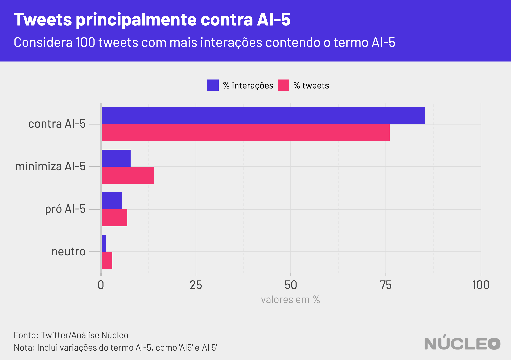

De tempos em tempos manifestantes pró-Bolsonaro pedem a volta do Ato Institucional Nº 5. No domingo 19 de abril, Dia do Exército, não foi diferente. Mas o termo "AI-5" disparou no Twitter não pelos perfis de seus defensores, e sim por seus críticos.

Análise do Núcleo com 136 mil tweets com esse termo mostrou que as principais publicações, aquelas com mais interações (curtidas e retuítes), se posicionaram majoritariamente contra o instrumento que tirou liberdades democráticas na década de 1960.

Dos 100 tweets com mais engajamento, 76 foram desfavoráveis ao AI-5, ao passo que 14 minimizam os protestos favoráveis e apenas sete foram a favor.

---

###### É importante porque...

- *O Twitter sempre foi importante para a comunicação de Bolsonaro, inclusive em busca de apoio. Perder a conversa lá significa enfraquecimento dele em um de seus principais canais*

- *Boa parte das autoridades se comunica com suas bases pelo Twitter, que se tornou um termômetro de discussão política e de assuntos do momento no país, pautando autoridades, imprensa e o debate em geral*

---

No total, foram contabilizadas 1,63 milhão de interações nos 136 mil tweets. Os 100 maiores tweets foram responsáveis por 1,2 milhão de interações, o que indica um grande número de publicações com pouca ou nenhuma interação.

As críticas de ativistas, políticos e personalidades da esquerda serviram para impulsionar o uso do termo na rede social, especialmente para criticar a postura do presidente.

Jair Bolsonaro fez um [breve discurso](https://www.poder360.com.br/governo/bolsonaro-discursa-em-ato-com-pauta-a-favor-do-ai-5-e-contra-o-congresso/) no evento realizado à frente do Quartel-General do Exército, em Brasília, com a presença de manifestantes que seguravam cartazes a favor da intervenção militar e do AI-5, e pediam pela saída do presidente da Câmara dos Deputados, Rodrigo Maia (DEM-RJ).

O termo Ai-5 teve uma permanência pequena, mas constante, no Twitter pelo menos desde o dia 12, chegando a quase 6.000 tuítes por hora no fim da tarde de domingo.

Os dados consideram apenas tweets únicos, ou seja, sem considerar retweets e seus comentários. Isso serve para medir a espontaneidade de cada tweet, em vez da reação das pessoas a eles. Os trending topics do Twitter consideram retuítes em suas contas sobre o montante de publicações, o que infla o número de tweets realmente originais.

### Principais tweets

- Com mais interações no geral

<blockquote class="twitter-tweet">
Soltei o berrante na cara dos gado que pedia AI-5 agora em Brasília, tentaram quebrar meu carro mas não fizeram nem cosquinha. <a href="https://t.co/HrKepFjsRF">pic.twitter.com/HrKepFjsRF</a>
&mdash; GugaNoblat (@GugaNoblat) <a href="https://twitter.com/GugaNoblat/status/1251936367975825413?ref_src=twsrc%5Etfw">April 19, 2020</a></blockquote> 

 

- Pró-Ai-5 com mais interações

<blockquote class="twitter-tweet">
Galera que tá no <a href="https://twitter.com/hashtag/TchauMaia?src=hash&amp;ref_src=twsrc%5Etfw">#TchauMaia</a> e no AI-5 por favor, não esqueçam que se o <a href="https://twitter.com/davialcolumbre?ref_src=twsrc%5Etfw">@davialcolumbre</a> não pautar a carteira verde e amarela amanhã ela vai caducar e a chance de empregar milhões no pós vírus Chinês vai pelo ralo! Eles querem o caos econômico, não deixem de cobrar o Alcolumbre!!
&mdash; TeAtualizei 🇧🇷👊🏻❤️ (@taoquei1) <a href="https://twitter.com/taoquei1/status/1251938884923142145?ref_src=twsrc%5Etfw">April 19, 2020</a></blockquote> 

 

- Tweet que minimiza o AI-5 com mais interações

<blockquote class="twitter-tweet">
Impressionante a canalhada querendo desqualificar manifestações a favor de Bolsonaro e contra arroubos de Rodrigo Maia como se fossem atos pelo ai-5, ou contra o Congresso. Democracia pulsando forte, povo mandou seu recado hoje.
&mdash; Flavio Bolsonaro (@FlavioBolsonaro) <a href="https://twitter.com/FlavioBolsonaro/status/1252030404179243011?ref_src=twsrc%5Etfw">April 20, 2020</a></blockquote> 

---

###### Na imprensa

* [Esquerda inflama após ato pró-intervenção com Bolsonaro, e direita fala de golpe contra presidente](https://www1.folha.uol.com.br/poder/2020/04/esquerda-inflama-apos-ato-pro-intervencao-com-bolsonaro-e-direita-fala-de-golpe-contra-presidente.shtml) &sdot; *Folha de S.Paulo* &sdot; (20/04/2020)

* [O bolsonarismo se reorganiza nas redes](https://veja.abril.com.br/blog/thomas-traumann/o-bolsonarismo-se-reorganiza-nas-redes/amp/?__twitter_impression=true) &sdot; *Veja* &sdot; (20/04/2020)
-
---

### METODOLOGIA

O Núcleo capturou cerca de 136 mil tweets com o termo 'AI-5' e variações ortográficas entre dias 11 e 20 de abril, utilizando a API gratuita do Twitter. O código para extração pode ser [encontrado aqui](https://gist.github.com/voltdatalab/a342c1179284deafa5c508dad33373f5).

Com a finalidade de manter a privacidade de usuários com perfis pouco notórios, o Núcleo não vai divulgar a base total com, os dados brutos – cada pessoa pode rodar o código de extração para obter esses resultados. Os dados com os 100 tweets mais populares e a série temporal podem ser [acessados aqui](https://docs.google.com/spreadsheets/d/1EotNWi6V4iTwa8ck3TV6AVmssT6qmQ3Ax8unn5WoxvU/edit?usp=sharing).

A conta considera apenas tuítes únicos, ou seja, exclui retuítes e respostas a tuítes. Isso porque queremos medir a espontaneidade de publicações sobre o tema.
