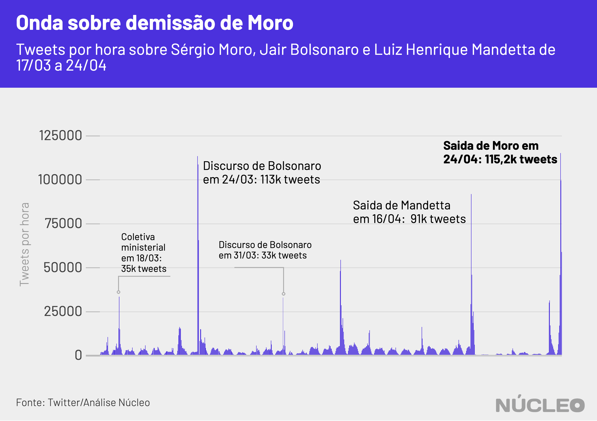

O anúncio, na manhã de 24 de abril, sobre a [saída](https://g1.globo.com/politica/noticia/2020/04/24/moro-anuncia-demissao-do-ministerio-da-justica-e-deixa-o-governo-bolsonaro.ghtml) de Sergio Moro do Ministério da Justiça gerou a maior onda de engajamento político no Twitter desde o início das políticas de isolamento social no Brasil, em meados de março, mesmo considerado pronunciamentos polêmicos do presidente Jair Bolsonaro, manifestações de rua e até a demissão do ministro da Saúde.  

No pico dessa onda, foram registrados 115,2 mil tweets únicos em uma única hora sobre o ex-ministro da Justiça, ao passo que o pronunciamento de Bolsonaro em 24 de março, maior engajamento até então, gerou 113 mil tweets únicos em uma hora.

---

###### É importante porque...

- *O Twitter sempre foi importante para a comunicação de Bolsonaro, inclusive em busca de apoio. Perder a conversa lá significa enfraquecimento dele em um de seus principais canais*

- *Boa parte das autoridades se comunica com suas bases pelo Twitter, que se tornou um termômetro de discussão política e de assuntos do momento no país, pautando autoridades, imprensa e o debate em geral*

---

Boa parte da militância e dos apoiadores de Bolsonaro se posiciona no Twitter, uma plataforma que nos últimos anos serve como termômetro sobre o debate político no Brasil.

##### O assunto teve tempo para ganhar força, e estava nas manchetes desde o dia anterior.

Diversos veículos de imprensa relataram na tarde de quinta-feira, dia 23, que Moro ameaçava sair do governo caso Bolsonaro prosseguisse com a demissão do diretor-geral da Polícia Federal, Maurício Valeixo, e não considerasse as determinações de Moro sobre um sucessor. Enquanto isso, a ala militar do governo buscava a permanência do ministro.

Mas, na manhã desta quarta-feira, uma decisão foi publicada no Diário Oficial da União exonerando o diretor, com a [assinatura](https://g1.globo.com/politica/noticia/2020/04/24/diario-oficial-publica-exoneracao-de-moro-e-republica-a-de-valeixo-sem-a-assinatura-do-ex-ministro.ghtml) de Sergio Moro, mas sem seu conhecimento.  

O **Núcleo** analisou 609 mil tweets que mencionam Sergio Moro desde o dia 17 de abril e constatou que, por conta de sua saída, a maioria das publicações continha uma carga negativa, principalmente pelas críticas à saída do ministro ou a Bolsonaro.

Em uma amostragem dos 100 principais tweets -- aqueles com mais engajamento (curtidas e retweets) -- desta sexta-feira sobre a saída do ministro, mais da metade eram favoráveis a ele, ao passo que apenas 10% tinham apoio declarado ao presidente.

### Top 100 tweets classificados

|                            | % do total           |
|----------------------------|----------------------|
| mais favorável a Moro      | 52%                  |
| neutro                     | 21%                  |
| desfavorável a ambos       | 17%                  |
| mais favorável a Bolsonaro | 10%                  |

Mas o ministro também foi duramente criticado junto a Bolsonaro em alguns tweets, principalmente por parte de políticos e interlocutores de esquerda que questionaram as decisões que o levaram até o ministério.

Houve também uma minoria que criticou o ministro e apoiou Bolsonaro ao mesmo tempo, num indicativo de que, pelo menos para uma parcela de seus apoiadores, o presidente teve respaldo nessa disputa.

* Exemplo de tweet favorável a Moro

<blockquote class="twitter-tweet">
Olha... eu faço muitas críticas ao Sérgio Moro e as continuarei fazendo, mas esse pronunciamento precisa ser elogiado. To impressionada. (E atrasada pro trabalho pq não consegui sair da frente da TV).
&mdash; Gabriela Prioli (@GabrielaPrioli) <a href="https://twitter.com/GabrielaPrioli/status/1253697454148648961?ref_src=twsrc%5Etfw">April 24, 2020</a></blockquote>   

* Exemplo de tweet crítico a Moro e a Bolsonaro

<blockquote class="twitter-tweet">
Tem gente dizendo que “Moro saiu com dignidade”. Rapaz, se tivesse dignidade não teria nem entrado...
&mdash; Túlio Gadêlha (@tuliogadelha) <a href="https://twitter.com/tuliogadelha/status/1253710046405500928?ref_src=twsrc%5Etfw">April 24, 2020</a></blockquote>   

* Exemplo de tweet crítico a Moro e favorável a Bolsonaro

<blockquote class="twitter-tweet">
1. Pq o Moro nomear um delegado de sua confiança como diretor da PF é &quot;técnico&quot; e o Presidente fazê-lo é &quot;interferência política&quot;?  2. Moro, sinto, mas segundo o nosso &quot;Rule of Law&quot;, quem nomeia o diretor da PF é o PR. Se você queria fazê-lo, bastaria ter se candidatado em 2018.
&mdash; Paulo Figueiredo Filho (@realpfigueiredo) <a href="https://twitter.com/realpfigueiredo/status/1253707983713861632?ref_src=twsrc%5Etfw">April 24, 2020</a></blockquote> 

### CARGA DE SENTIMENTOS NOS TWEETS

A maioria das mensagens analisadas era negativas. Dos 609 mil tweets, em cerca de 40% deles foi possível analisar alguma carga de sentimento.

Sentimentos negativos indicam que o debate tende a ser carregado de adjetivos e críticas pesadas, ao passo que os positivos refletem frequentemente um tom mais ameno e elogioso (seja a Bolsonaro ou a Moro, por exemplo), mas também pode representar ironias (alguém usando termos afáveis para ironizar uma posição desfavorável, por exemplo).

Publicações com carga negativa são usuais no Twitter, à medida que a rede social é reconhecidamente um lugar de crítica política e campo de batalha ideológico entre esquerda e direita, mas o que chama a atenção nesse caso é a diferença em que essa distribuição acontece logo após o tweet de Mandetta e nos momentos seguintes.

---

###### Na imprensa

* [Após pronunciamento de Bolsonaro, direita radical se isola no apoio a presidente](https://www1.folha.uol.com.br/poder/2020/04/nem-direita-radical-fica-com-bolsonaro-na-demissao-de-moro.shtml) &sdot; *Folha de S.Paulo* &sdot; (24/04/2020)

---

### METODOLOGIA

O **Núcleo** capturou cerca de 609 mil tweets com o termo 'Sergio Moro' e variações ortográficas entre dias 17 e 24 de abril, utilizando a API gratuita do Twitter. O código para extração pode ser [encontrado aqui](https://gist.github.com/voltdatalab/a342c1179284deafa5c508dad33373f5).

O vocabulário dos tuítes foi comparado com dois léxicos da biblioteca [lexiconPT](https://cran.r-project.org/web/packages/lexiconPT/lexiconPT.pdf), que relaciona diferentes palavras do português com valores de sentimentos positivos ou negativos atribuídos a elas. O algoritmo foi capaz de detectar a carga de sentimento de 310 mil tweets.

Como ainda não é possível saber quem certa carga de sentimento favorece ou critica, fizemos, então, uma classificação manual dos 100 tweets com mais engajamento (curtidas + retuítes), divididos entre:

* Mais favorável a Moro
* Mais favorável a Bolsonaro
* Desfavorável a ambos
* Neutro

Com a finalidade de manter a privacidade de usuários com perfis pouco notórios, o Núcleo não vai divulgar a base total com, os dados brutos – cada pessoa pode rodar o código de extração para obter esses resultados. Os dados com os 100 tweets mais populares e a série temporal podem ser [acessados aqui](https://docs.google.com/spreadsheets/d/1D1Gz3k-XDhcLp2lV4YdbO-t94H0kl9RAbdrVKZZ-52M/edit?usp=sharing).

A conta considera apenas tuítes únicos, ou seja, exclui retuítes e respostas a tuítes. Isso porque queremos medir a espontaneidade de publicações sobre o tema.
