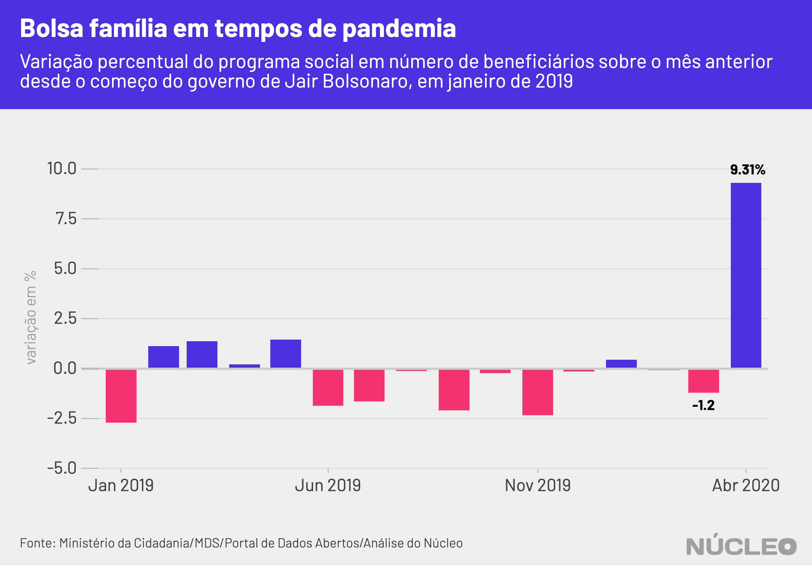

Em meio à pandemia de coronavírus e de políticas de isolamento social que paralisaram boa parte da economia nacional, o governo do presidente Jair Bolsonaro interrompeu o enxugamento do Bolsa Família, e o número de famílias beneficiadas cresceu 9,3% em abril sobre março, chegando a 14,27 milhões.

A alta no total de beneficiários faz parte [das ações](https://www.gov.br/economia/pt-br/acesso-a-informacao/acoes-e-programas/covid-19) do governo federal para ampliar assistência às pessoas mais carentes e vulneráveis, como resposta à crise econômica causada pela epidemia.

No entanto, o aumento acontece em um momento excepcional, e é precedido de repetidas quedas nos últimos 12 meses. Desde junho de 2019 o número de famílias no Bolsa Família não ficava acima de 14 milhões.

---

###### É importante porque...

- *O Bolsa Família é o maior programa social do Brasil, e parte essencial de políticas do governo para mitigar os efeitos econômicos da epidemia de coronavírus*

- *Em momento de isolamento social para combater a COVID-19, em que muitas pessoas não estão saindo para trabalhar, as famílias recipientes precisam de renda mais do que nunca*

---

O ministro da Cidadania, Onyx Lorenzoni, já [havia sinalizado](https://economia.uol.com.br/noticias/estadao-conteudo/2020/03/30/onyx-diz-que-bolsa-familia-atendera-mais-de-14-milhoes-de-familias-ate-abril-em-crise-de-coronavirus.htm) no fim de março que o número de famílias beneficiadas ficaria acima do patamar de 14 milhões.

Mesmo assim, o dado destoa do enxugamento resultante de políticas de ajuste fiscal da equipe econômica liderada por Paulo Guedes, como já [mostrou](https://nucleo.jor.br/governo/2020-03-31-bolsa-familia-cai-em-marco) o **Núcleo**, e escancara a urgência de auxílios emergenciais para combater a crise financeira e o desemprego durante a epidemia, algo apoiado até pelos economistas mais liberais.  

Assim, o número de famílias beneficiadas, que caiu em nove dos últimos 12 meses, chegando a 13,06 milhões no menor nível, subiu para 14,27 milhões.

| mês     | famílias beneficiadas | variação (%) sobre mês anterior |
|---------|-----------------------|---------------------------------|
| 01/2019 | 13.760.886            | -2,7                            |
| 02/2019 | 13.914.330            | 1,12                            |
| 03/2019 | 14.105.240            | 1,37                            |
| 04/2019 | 14.134.323            | 0,21                            |
| 05/2019 | 14.339.058            | 1,45                            |
| 06/2019 | 14.072.368            | -1,86                           |
| 07/2019 | 13.841.302            | -1,64                           |
| 08/2019 | 13.826.716            | -0,11                           |
| 09/2019 | 13.537.137            | -2,09                           |
| 10/2019 | 13.505.758            | -0,23                           |
| 11/2019 | 13.189.567            | -2,34                           |
| 12/2019 | 13.170.607            | -0,14                           |
| 01/2020 | 13.228.015            | 0,44                            |
| 02/2020 | 13.216.880            | -0,08                           |
| 03/2020 | 13.058.228            | -1,2                            |
| 04/2020 | 14.274.274            | 9,31                            |

<figcaption>Fonte: <a href="http://aplicacoes.mds.gov.br/sagi/servicos/misocial?q=*&fq=anomes_s:2020*&fq=tipo_s:mes_mu&wt=csv&fl=ibge:codigo_ibge,anomes:anomes_s,qtd_familias_beneficiarias_bolsa_familia,valor_repassado_bolsa_familia&rows=10000000&sort=anomes_s%20asc,%20codigo_ibge%20asc"> API Ministério da Cidadania</a></figcaption>

O **Núcleo** consultou a API oficial do Bolsa Família oficial do Ministério da Cidadania nesta sexta-feira, 1º de maio, e os dados de abril já [constavam lá](http://aplicacoes.mds.gov.br/sagi/servicos/misocial?q=*&fq=anomes_s:2020*&fq=tipo_s:mes_mu&wt=csv&fl=ibge:codigo_ibge,anomes:anomes_s,qtd_familias_beneficiarias_bolsa_familia,valor_repassado_bolsa_familia&rows=10000000&sort=anomes_s%20asc,%20codigo_ibge%20asc) - mas ainda não no [site](https://aplicacoes.mds.gov.br/sagi/vis/data3/v.php?q[]=5ItjcmGJnfSh1aLB1MiFcoeVhX5hhoNzgIuIhJh2dHukfYXnybKys9%2B%2BsqilzpK4yca6q7DVybrMibllqHyigKm%2FudC0iLe6osWKpucSF63jsN11k66z2d3NurM2Asm3ycZTpqB5verfwKSm1K1zhMbNy69Qn7SvCAbEu8nFtIQ%3D).

Reportagem do UOL no fim de abril [mostrou](https://economia.uol.com.br/noticias/redacao/2020/04/28/governo-gastou-menos-de-4-dos-recursos-destinados-a-ampliar-bolsa-familia.htm) que o governo havia usado apenas uma pequena parte do montante destinado ao programa social, segundo dados do [Tesouro Nacional](https://www.tesourotransparente.gov.br//visualizacao/painel-de-monitoramentos-dos-gastos-com-covid-19).

### METODOLOGIA

O **Núcleo** baseou todas as suas análises em dados fornecidos diretamente pelo Ministério da Cidadania, sob a rubrica do Ministério do Desenvolvimento Social. Essas informações foram obtidas diretamente da API tal como disponibilizada no [Portal de Dados Abertos do governo federal](http://www.dados.gov.br/dataset/bolsa-familia-misocial), que contém valores e números de famílias agrupados por município.

É possível encontrar dados do Bolsa Família também no [Portal da Transparência](http://www.portaltransparencia.gov.br/beneficios/consulta?de=01%2F01%2F2020&ate=01%2F12%2F2020&ordenarPor=mesAno&direcao=desc) do governo federal.

A extração dos dados e as análises foram feitas utilizando a linguagem de programação R, e os códigos podem ser encontrados integralmente [neste link](https://gist.github.com/voltdatalab/c68c1fa1e2c23e97c9ef1e69f296952a).

Por termos feito apenas uma agregação dos dados oficiais disponibilizados, sem juízo de valor, o **Núcleo** não entrou em contato com o governo para pedir esclarecimentos. Se governo, organizações ou pessoas desejarem enviar algum esclarecimento acerca desses dados, favor contatar os editores no email [nucleo@voltdata.info](mailto:nucleo@voltdata.info).

Essa reportagem *pode* ser atualizada caso os dados sejam atualizados.
