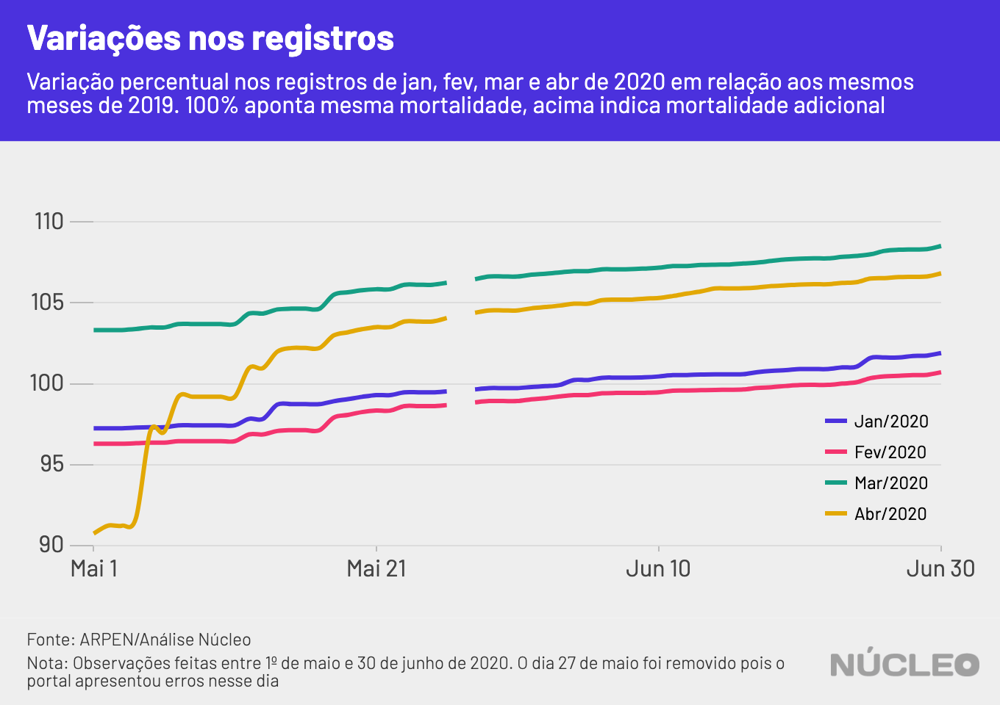

Desde abril, dados do [Portal de Transparência do Registro Civil](https://transparencia.registrocivil.org.br/inicio) foram utilizados para espalhar desinformação e construir notícias falsas ou enganosas acerca de óbitos não confirmados de Covid-19 no Brasil.

Uma análise do **Núcleo**, a partir da observação de atualizações no portal de 1º de maio a 30 de junho, mostra como limitações na contabilização de novos registros de óbitos tornam esses dados insatisfatórios para análises sobre a pandemia no país. O assunto foi primeiramente abordado pela [Folha de S.Paulo](https://www1.folha.uol.com.br/equilibrioesaude/2020/05/base-de-dados-de-cartorios-traz-falhas-que-impedem-calcular-efeito-real-do-coronavirus-no-brasil.shtml).

---

###### É importante porque...

- *Dados como esses são utilizados para tomada de decisões na pandemia, e precisam ser analisados com rigor*

- *Além de olhar os dados, é importante compreender a dinâmica de atualização do portal*

- *Um portal de divulgação de dados sem a devida contextualização pode ser utilizado para criar narrativas falsas através de informações verdadeiras*

---

A principal característica da maior parte dessas peças era comparar dados de um mês que terminava (na época, abril) com o mesmo mês no ano anterior, e a partir daí indicar que não havia crescimento no número de óbitos de um ano para o outro. Uma das conclusões foi de que a pandemia da Covid-19 não era tão grave quanto estava sendo propagado pela imprensa e por certos políticos.

Essas narrativas, contudo, ignoravam possíveis limitações na notificação na própria plataforma, incluindo atrasos e os prazos legais, que são de:

- 24 horas para a família informar o cartório sobre o falecimento;

- 5 dias para o cartório efetuar o registro de óbito;

- 8 dias para o Centro Nacional de Informações do Registro Civil que atualiza o portal.

Esses prazos legais indicam que um atraso de até 14 dias deve ser esperado para atualização do portal, o que provavelmente reflete sobre a totalidade de certo mês.

### Acompanhamento diário

Acompanhamento do registro de óbitos no Brasil feito pelo **Núcleo** revela que alguns dados podem demorar muito mais do que 14 dias para serem computados no Portal de Transparência do Registro Civil.

A primeira observação, percebida nos primeiros cinco dias de acompanhamento, refere-se ao aumento de 6.000 registros para o mês de abril, indicando que o atraso esperado de até 14 dias realmente afeta o sistema. Mas durante o mesmo período também foi possível observar que registros foram adicionados aos meses de janeiro, fevereiro e março.

| Dia do acompanhamento | Jan/2020 | Feb/2020 | Mar/2020 | Apr/2020 | May/2020 |
|-----------------------|----------|----------|----------|----------|----------|
| 01/Maio               | 102.244  | 85.782   | 97.382   | 93.131   | 0        |
| 02/Maio               | 102.244  | 85.784   | 97.383   | 93.630   | 260      |
| 03/Maio               | 102.244  | 85.784   | 97.383   | 93.630   | 260      |
| 04/Maio               | 102.286  | 85.813   | 97.444   | 94.129   | 598      |
| 05/Maio               | 102.311  | 85.844   | 97.538   | 99.588   | 5.559    |

Analisando anos anteriores, o mesmo acontece. Mesmo 2016 ganhou **novos** registros de óbitos em maio deste ano. Apesar dos números de registros adicionados serem baixos, indicam que o sistema possui atrasos muito além do prazo legal indicado.

Vale notar que o sistema não atualizou os dados em 15 dos 31 dias acompanhados.

### O sumiço de 500 mil registros

No dia 14 de maio, os dados para os anos de 2016, 2017 e 2018 tiveram alterações relevantes.

A soma de registros do triênio, que antes totalizava 3.469.202 óbitos, foi então reduzida para 2.876.131, indicando possível problema na fidedignidade dos registros da plataforma, até no longo prazo. O caso foi primeiramente reportado na imprensa pela [Folha de S.Paulo](https://www1.folha.uol.com.br/equilibrioesaude/2020/05/meio-milhao-de-mortes-somem-de-sistema-usado-para-monitorar-covid-19.shtml) em 14 de maio, e teve como fonte [relato](https://twitter.com/lucaslago/status/1260970890294104066) do jornalista do **Núcleo** no Twitter.  

A Associação Nacional dos Registradores de Pessoas Naturais (ARPEN Brasil) [informou em nota](https://www1.folha.uol.com.br/equilibrioesaude/2020/05/meio-milhao-de-mortes-somem-de-sistema-usado-para-monitorar-covid-19.shtml) que os dados removidos eram referentes ao Estado do Rio de Janeiro, e que foram removidos por não estarem padronizados no mesmo formato que os dados dos outros estados.

No entanto, o desencontro de dados foi suficiente para impulsionar algumas peças de desinformação, inclusive as que acusavam a ARPEN de manipular os dados com a intenção de fazer com que a Covid-19 pareça mais letal do que realmente seria. A teoria ganhou impulso inclusive nas redes sociais de [pessoas](https://twitter.com/AiltonBenedito/status/1263181237126139904) que trabalham em entidades do Estado brasileiro.

Os dados não foram reinseridos na plataforma até o dia da publicação deste artigo.

### Sumiço e reaparecimento de 3 milhões de registros
Na manhã do dia 27 de maio, 70% dos registros de óbitos foram removidos da plataforma, novamente levantando suspeitas sobre a confiabilidade do portal.  

A ARPEN Brasil informou ao **Núcleo** via Whatsapp que os dados desapareceram por conta de um erro na atualização da base de dados e que isso seria corrigido no dia seguinte.

No dia 28 de maio, esses dados estavam corretamente registrados na plataforma.

### Possibilidades de uso dos dados

Tanto jornalistas quanto especialistas e gestores públicos estão procurando fontes de dados confiáveis para ajudar a compreender a pandemia. Fontes não confiáveis, porém, podem [levar a erros](https://edition.cnn.com/interactive/2020/05/world/worldometer-coronavirus-mystery/index.html), especialmente na tomada de decisões em tempo real.

Os dados do Portal da Transparência do Registro Civil possuem eficiência dentro de contextos e análises específicas, mas sua utilidade na análise da situação epidemiológica é questionável.

Em sistemas de processamento distribuídos há diferentes estratégias para estruturação e criação de consistência na entrada de dados. Intuitivamente imaginamos que os dados são cadastrados de tal forma que são consistentes desde o primeiro momento – por exemplo, após um falecimento, o registro de óbito é realizado e está presente e disponível para o portal.

Existem, porém, mais de 7.500 cartórios no Brasil, em regiões com realidades completamente diferentes. Essas informações são agregadas em um sistema centralizado – o portal da transparência. Cada um desses cartórios realiza o processamento local do registro de óbito e depois envia para o sistema central.

Mas esses cartórios podem possuir dinâmicas próprias e atrasos pontuais ou sistêmicos, ocasionados pelos recursos e limitações únicos de cada um. Em sistemas onde os dados são alimentados de forma assíncrona por unidades de processamento locais, dá-se o nome de '[sistemas de consistência eventual](https://www.youtube.com/watch?v=RY_2gElt3SA)'. _Para uma explicação mais detalhada, ver o [artigo na Wikipedia](https://en.wikipedia.org/wiki/Eventual_consistency), em inglês_.

Sistemas com consistência eventual partem do princípio de que é mais importante divulgar algum dado, ainda que impreciso, do que aguardar para que todos os atrasos sejam solucionados e os dados estejam completamente consistentes. Isso vale tanto para sistemas onde a consistência do valor não é o mais importante, quanto para situações onde atrasos estão fora do controle do sistema central.

Portanto, sistemas assim são amplamente utilizados em diversos serviços onde a precisão do valor é menos relevante que a disponibilização aproximada do valor. Redes sociais e plataformas de vídeo, por exemplo, utilizam esse tipo de estratégia ao contar curtidas e visualizações.

##### **RESUMINDO**: o uso da estratégia de consistência eventual pelo Portal de Transparência do Registro Civil acontece porque os dados são registrados de forma distribuída em cartórios com realidades extremamente diferentes, e esperar a plena consistência para publicação reduziria a utilidade da informação.

Assim, sabendo que a arquitetura do sistema segue a estratégia de consistência eventual, podemos traçar algumas premissas para utilizar esses dados.

### METODOLOGIA

Pelo acompanhamento que realizamos e com informações fornecidas com o representante do portal é possível estabelecer algumas premissas de como a base de dados se comporta:

1. Exceto por interferência da ARPEN ou erros, a curva de registros é estritamente crescente;

2. A atualização é irregular, existem dias em que os dados não são atualizados.

3. Existe atraso para todos os registros de óbito no país, porém eles não são distribuídos igualmente na extensão do país;

4. Um aumento súbito no número de registros não reduziria os atrasos que acontecem no sistema. Pode ser que um aumento súbito no número de registros aumente o atraso;

5. As variações diárias para um período são menores quanto mais antigo é esse período, ou seja, os dados se aproximam cada vez mais do valor real porém a taxa de atualização é cada vez menor.

Com as premissas apresentadas acima, podemos analisar os dados coletados no portal.

A comparação com o maior valor registrado para os dois primeiros meses de 2019 e os dados para os mesmos meses em 2020, mostra que seria esperado um aumento no número de óbitos para o ano corrente.

Mas apesar de os primeiros quatro meses de 2020 possuírem mais registros que o mesmo período em 2019, os meses afetados pela pandemia (março e abril, no caso) já mostram porcentagens _expressivamente_ maiores na comparação com o ano anterior:

| Mês (2020) | Nº de registros de óbito em 31 de maio | % em relação ao mesmo mês em 2019 |
|------------|--------------------------------------------|---------------------------------------------|
| Janeiro    | 104.853                                    | 101.4%                                      |
| Fevereiro  | 88.140                                     | 100.5%                                      |
| Março      | 100.507                                    | 108.2%                                      |
| Abril      | 107.281                                    | 105.7%                                      |

Note que os registros de óbitos referentes a abril de 2020 (observados em maio) subiram de 91% para 105,7% do valor registrado em 2019 para o mesmo período.

O Núcleo acompanhou o Portal da Transparência do Registro Civil diariamente. Não foram examinados os dados do [Especial Covid-19](https://transparencia.registrocivil.org.br/especial-covid), mas sim aqueles relativos ao número absoluto de registros de óbitos no país. Não foi realizado também nenhum acompanhamento regional específico.

<figcaption>Reprodução de aviso no Portal de Transparência do Registro Civil, datado de 3 de julho de 2020.</figcaption>
