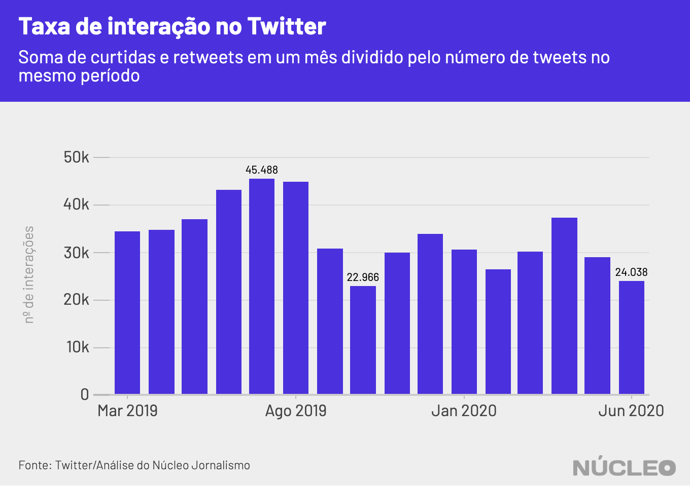

O engajamento das publicações de Jair Bolsonaro no Twitter tem minguado nas últimas semanas para o menor patamar em mais de um ano.

Análise do **Núcleo** com dados do [Monitor Nuclear](../monitor) com os últimos 3.876 tweets originais de Bolsonaro desde fevereiro de 2019 mostra que a `tendência de engajamento` do presidente está em queda desde a semana da divulgação do [vídeo](https://g1.globo.com/politica/noticia/2020/05/22/em-reuniao-bolsonaro-diz-nao-posso-ser-surpreendido-com-noticias-po-eu-tenho-a-pf-que-nao-me-da-informacoes-assista.ghtml) da reunião ministerial e de sua entrevista à frente do Palácio do Alvorada para criticar a ação do STF contra desinformação, para o qual ele [deu o alerta](https://www.youtube.com/watch?v=-0VmL3IxtI0) "acabou, porra".

---

###### É importante porque...

- *O Twitter sempre foi importante para a comunicação de Bolsonaro, inclusive em busca de apoio. Perder a engajamento lá significa menos interesse em suas mensagens*

- *Boa parte das autoridades se comunica com suas bases pelo Twitter, que se tornou um termômetro de discussão política e de assuntos do momento no país, pautando autoridades, imprensa e o debate em geral*

---

Para avaliar tendências no engajamento de políticos, o algoritmo do Monitor Nuclear calcula a média móvel da relação entre o total de interações simples (curtidas e retweets) em tweets originais e o número de publicações por dia. Esse cálculo serve para atenuar oscilações diárias e mostrar o comportamento dos dados no curto prazo.

O engajamento médio do presidente, considerando um intervalo de 15 dias, está no menor patamar em mais de um ano (desde julho de 2019), caindo severamente após um pico no final de maio e começo de junho.

Não que o presidente tenha ficado longe de controvérsias, como ter feito um [vídeo](https://veja.abril.com.br/politica/jair-bolsonaro-toma-hidroxicloroquina-em-video-e-diz-esta-dando-certo/) no qual toma cloroquina após ter sido diagnosticado com Covid-19 (o remédio [não tem eficácia comprovada](https://www.paho.org/bra/index.php?option=com_content&view=article&id=6101:covid19&Itemid=875#cloroquina-hidroxicloroquina) contra a doença e é algo de constante especulação e desinformação), o imbróglio envolvendo a [saída](https://g1.globo.com/politica/noticia/2020/06/18/ministro-da-educacao-abraham-weintraub-anuncia-saida-do-cargo-em-video-com-bolsonaro.ghtml) do ministro da Educação e a eventual nomeação de outro nome para o cargo, que logo foi forçado a deixar o governo por [ter mentido](https://g1.globo.com/educacao/noticia/2020/06/29/entenda-as-polemicas-sobre-os-titulos-academicos-do-novo-ministro-da-educacao-carlos-alberto-decotelli.ghtml) em seu currículo. Mas isso não se refletiu diretamente em interesse pelos tweets do presidente.

A `taxa de engajamento` (média de interações por dia de cada tweet) vem apresentando tendência de queda pelo menos desde o começo do mandato, no início de 2019, mesmo com os picos no fim de maio e começo de junho.  

Considerando um agrupamento mensal, para facilitar a visualização, as interações médias por tweet foram de 24 mil curtidas e retweets em junho de 2020, segundo menor patamar da série analisada pelo **Núcleo** (gráfico abaixo).

Essa queda acontece no mesmo momento em que Bolsonaro tem tuitado um pouco mais.

### METODOLOGIA
O **Núcleo** usou dados do [Monitor Nuclear](../monitor) para fazer essas análises.

O Monitor Nuclear é uma aplicação do Núcleo Jornalismo que identifica tendências de engajamento no Twitter, considerando tweets publicados pelos principais políticos brasileiros e possíveis pré-candidatos à eleição presidencial de 2022.

Esses dados são relevantes porque podem indicar tanto o humor do momento quanto a mobilização de bases de apoio ou de oposição em relação a certo ator político ou assunto.

Com apenas 14,35 milhões de usuários, o Twitter está longe de representar o eleitorado brasileiro, mas, nos últimos anos, a rede social passou a funcionar como um termômetro do debate político no Brasil.

A análise é baseada em três variáveis: data de publicação, total de curtidas por tweet e total de retweets por tweet.

Os dados não consideram comentários, por dois motivos:

1. curtidas e retweets estão limitados a apenas um por perfil, funcionando quase como uma métrica de endosso ao conteúdo. Isso torna mais difícil para bots e perfis falsos inflarem artificialmente tweets originais, ao contrário do que acontece com uma hashtag, por exemplo, à medida que um perfil pode curtir múltiplos tweets com um termo.

2. comentários são ilimitados, o que pode inflar indevidamente o número de interações. Além disso, eles frequentemente não refletem uma interação provável de endosso, podendo ser críticos, ofensivos, spam, piadas, memes ou tags para pessoas acompanharem o assunto.

Vale notar que a metodologia do Monitor é válida para se visualizar engajamento em perfis específicos, mas não acerca de dados conversacionais. Com uma hashtag ou campanha online, por exemplo, o caso é diferente, à medida que há vários tweets com hashtags ou termos que um bot ou um humano possam interagir em massa.

O **Monitor** agrega, por dia, o número de tweets disparados entre 00h e 23h59 e soma o total de curtidas e retweets. Essa soma é considerada como o `total de interações`.  

Isso nos permite calcular duas métricas fundamentais para nossa análise: a `taxa de engajamento` e `tendência de engajamento`.  

1. `Taxa de engajamento`: é a média simples do total de interações pelo número de tweets disparados em um único dia. Assim, se um perfil tuitou 10 vezes e teve 100 interações, a taxa de engajamento é de 10 interações por tweet. Se outro perfil tuitou uma vez e teve 100 interações, essa taxa é de 100 por tweet.

2. `Tendência de engajamento`: é a média móvel exponencial de X dias da taxa de engajamento. Consideramos 15 dias como o _default_, indicando um ciclo noticioso rápido, mas constante.  

Em todos os casos, a linha de tendência utiliza [regressão local (LOESS)](http://www.leg.ufpr.br/lib/exe/fetch.php/projetos:saudavel:loess.pdf), um método estatístico que estima curvas e superfícies através de suavização, melhor para identificar tendências de curto prazo.
