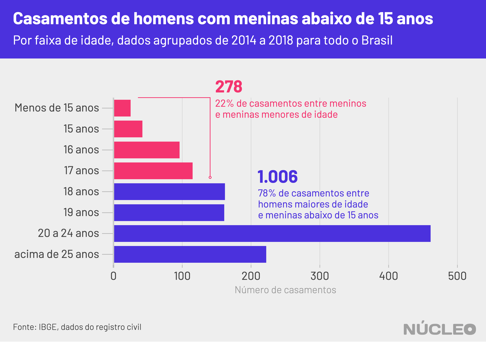

A notícia sobre o estupro de uma menina de 10 anos no Espírito Santo é o retrato de uma época na qual esse tipo de crime bate [recorde](http://crianca.mppr.mp.br/2020/03/233/ESTATISTICAS-Estupro-bate-recorde-e-maioria-das-vitimas-sao-meninas-de-ate-13-anos.html) no Brasil. Mas a história de violência sexual possui outras variáveis, por vezes mais opacas do que o próprio crime.

Longe da atenção do público estão casos no qual casamentos de crianças foram lavrados em registros públicos, legalmente. Entre 2014 e 2018, registrou-se no Brasil que pelo menos 1.284 meninas e 73 meninos menores de 15 anos se casaram, [prática](https://www12.senado.leg.br/noticias/materias/2019/03/13/proibicao-de-casamento-para-menor-de-16-anos-e-sancionada-pelo-governo-federal#:~:text=A%20legisla%C3%A7%C3%A3o%20anterior%20admitia%20o,a%2015%20anos%20de%20reclus%C3%A3o.) que foi proibida expressamente apenas em março de 2019 com uma [alteração](http://www.planalto.gov.br/ccivil_03/_ato2019-2022/2019/lei/L13811.htm) no Código Civil.

---

###### É importante porque...

- *Embora fosse crime, sob o Código Penal, ter relações sexuais com menores de 14 anos, o casamento de menores de 16 caso a criança estivesse grávida não era crime até março de 2019*

- *O atraso na legislação brasileira colocou a vida de muitos menores de idade, a grande maioria meninas, em risco*

---

A advogada Isabela Del Monde, da [Rede Feminista de Juristas](https://www.instagram.com/defemde/?hl=pt-br) (deFEMde), explica que até então o casamento de menores de 16 anos era permitido pelo Código Civil em casos de gravidez. No entanto, o Código Penal considera que relações sexuais com menores  de 14 configura estupro de vulnerável.

Os dados são da [mais recente](https://sidra.ibge.gov.br/pesquisa/registro-civil/tabelas) pesquisa de registro civil do IBGE, de 2018 -- ou seja, informados por cartórios.

O IBGE não informa a idade exata dos cônjuges menores de 15 anos, mas é possível afirmar que a maioria dos casamentos de meninas nessa faixa etária acontece com parceiros maiores de idade -- foram 1.006 uniões com homens de 18 anos ou mais, 78% do total.

Na outra ponta, 22% dos casamentos dessas meninas foram com menores de 18 anos.  

Vale notar que há mais de 2.058 mulheres e 1.902 homens cujos idades foram classificadas como "ignoradas" pelos cartórios, o que deve aumentar ainda mais o número de casamentos de menores.

O que esses dados revelam é que, apesar de desde 2005 o casamento não servir mais como forma de extinção de pena criminal por estupro de vulnerável, na prática ele seguia sendo usado assim.

Uma vez que casamento com menor de 16 anos era permitido somente em caso de gravidez e relação sexual de adulto com menor de 14 anos é estupro de vulnerável, esses 1.006 casamentos de homens adultos com meninas menores de 15 anos indicam exatamente isso: estupro de vulnerável sem pena criminal.

### CASAMENTO PROIBIDO

Desde março de 2019, o casamento de menores de 16 anos é proibido no Brasil. Já adolescentes entre 16 e 18 anos podem se casar com autorização dos pais ou de um juiz. O que surpreende é que, até então, o texto do Código Civil permitia o casamento com menores de 16 em casos de gravidez e também para evitar pena pelo crime de estupro de vulnerável.

Na verdade, desde 2005, a extinção de pena com o casamento já não estava mais prevista no Código Penal, mas o texto seguia no Código Civil. Ou seja: até 2005 o adulto que cometesse estupro de vulnerável tinha respaldo da justiça para não ser punido pelo crime caso se casasse com a vítima.

"A gente tinha uma contradição legislativa entre o Código Penal que estabelece o crime de estupro de vulnerável e o Código Civil que autorizava o casamento de menores de 16 anos em casos de gravidez. Não é incomum de haver no Brasil uma contradição de leis e, nesses casos, deveria ter sido aplicado o que estava previsto no Código Penal. Essa previsão antiga do Código Civil revela um conservadorismo e uma naturalização da violência sexual no Brasil", disse Isabela Del Monde.

Ela também observa que a justiça brasileira por muito tempo entendeu que casamento era uma forma de negar a violência sexual: até a criação da Lei Maria da Penha, em 2006, a justiça não previa estupro dentro do casamento.

#### [SAIBA MAIS - DOCUMENTÁRIO CASAMENTI INFANTIL (2018)](https://www.youtube.com/watch?v=qIPAKKzNZ_w)

### CASAMENTO INFANTIL

A UNICEF considera casamento infantil a união, formal ou informal, antes dos 18 anos. Segundo [relatório](https://data.unicef.org/resources/profile-of-child-marriage-and-early-unions-in-latin-america-and-the-caribbean/) da organização, uma em cada quatro meninas da América Latina se casa antes dos 18 anos.

No Brasil, entre 2014 e 2018, 181,7 mil menores de idade se casaram, sendo 93% meninas.

### METODOLOGIA

Os dados foram obtidos no [site SIDRA](https://sidra.ibge.gov.br/pesquisa/registro-civil/quadros/brasil/2018) do IBGE, na área de registro civil. Dados de registro civil demoram para ser computados, logo os mais recentes disponíveis até a data desta publicação eram de 2018. O **Núcleo** analisou dados de casamentos e casamentos agrupados por faixa de idade.
