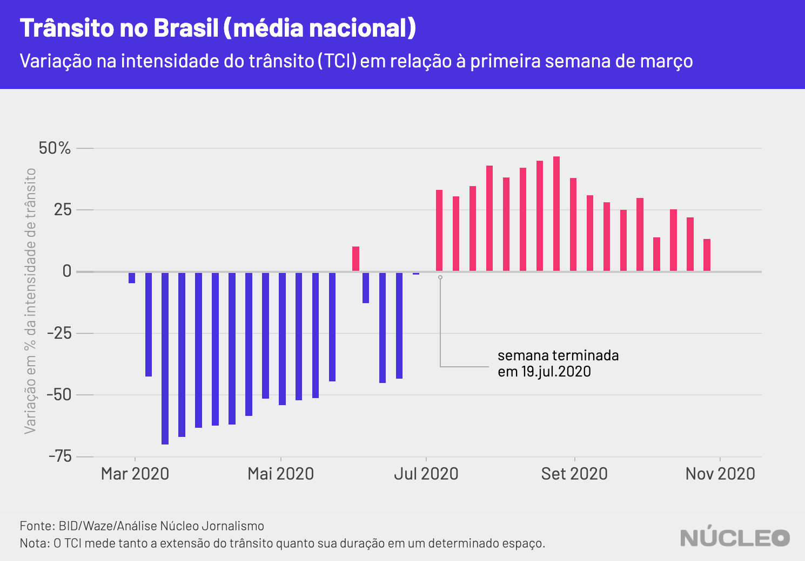

Dados confirmam o que você talvez já suspeite: a movimentação nas ruas de todo o Brasil de fato aumentou nos últimos meses e podemos dizer que a mobilidade retomou níveis pré-pandemia já em meados de julho -- um dos períodos de mais óbitos de Covid-19 no país.

Análise do **Núcleo** com dados do Banco Interamericano de Desenvolvimento/IDB Invest, em parceria com o aplicativo de mapas Waze, mostra que a movimentação de veículos no Brasil como um todo começou a disparar a partir da semana encerrada em 19 de julho em comparação à primeira semana de março.

---

###### É importante porque...

- *Mostra evidências do relaxamento no isolamento social*

- *Indica essa relaxamento num dos momentos mais graves da pandemia, reflexo de falta de políticas públicas*

---

Se considerarmos que o isolamento social no Brasil começou de fato na semana iniciada em 15 de março de 2020, isso significa uma retomada nos índices de movimentação de veículos a partir da 19a semana de quarentena.

Foi um dos períodos com mais óbitos semanais por conta de Covid-19 que o Brasil já viu. Em 25 de julho, o Brasil registrou uma média móvel de sete dias de 1.095 mortes por dia, o maior patamar até agora de acordo com dados do projeto [MonitoraCovid-19](https://bigdata-covid19.icict.fiocruz.br/), da Fiocruz. Já o pico de casos confirmados aconteceu em 28 de julho, na mesma métrica, com 47.514 confirmações.  

<i class="far fa-hand-pointer"></i> <small><em>Clique nos botões para trocar o gráfico</em></small>

  <button class="active botao" onclick="changeimg('{{ site.baseurl }}/img/covid/transito-normal/casos.png',this);">Novos casos Covid-19
  </button>
  <button class="botao" onclick="changeimg('{{ site.baseurl }}/img/covid/transito-normal/obitos.png',this);">Novos óbitos Covid-19
</button>

 
  

    
  

Esse é o quadro nacional, com dados de todas as partes do Brasil.

Na maioria das grandes cidades, o índice de movimentação de veículos continua menor do que na primeira semana de março. (Nota do Núcleo: Uma das hipóteses é que grandes cidades oferecem mais condições para trabalho remoto, como boa conexão à internet e empregos que de fato não exigem a presença física do funcionário.)

No entanto, é necessário notar que, apesar disso, é possível notar um afrouxamento constante do isolamento social nessas regiões metropolitanas, à medida que políticas de restrições a comércios e parques foram sendo relaxadas.

Se considerarmos grandes cidades, como São Paulo, Rio de Janeiro e Belo Horizonte, a movimentação foi aumentando semanalmente, e embora ainda seja menor do que no início do isolamento social, essa retomada tem peso no aumento nacional.

Além do cenário nacional, o BID discrimina dados de 24 regiões metropolitanas, num total de quase 80 milhões de brasileiros. Isso não permite analisar todas as minúcias da intensidade de trânsito em cada canto do território nacional, mas dá uma ideia boa.

##### Quais grandes cidades mais puxaram a retomada da "normalidade"?

Se considerarmos como ponto de partida a semana encerrada em 19 de julho, quando houve uma virada no âmbito nacional no trânsito, Santos foi onde houve maior alta -- potencialmente por causa do porto -- e única cidade com média positiva.

Manaus, Belém, Recife e Curitiba são grandes centros que também contribuíram bastante. São Paulo teve a oitava maior variação média, e o Rio de Janeiro, a décima.

<i class="far fa-hand-pointer"></i> <small><em>Mude a cidade para atualizar os dados</em></small>

### COMO FIZEMOS ISSO

Os [dados](https://www.iadb.org/en/topics-effectiveness-improving-lives/coronavirus-impact-dashboard) são baseados em um convênio entre o Banco Interamericano de Desenvolvimento e o [programa](https://www.waze.com/en/ccp) “Waze for Cities”.

Os gráficos desconsideram algumas cidades e países a fim de facilitar a visualização de dados.

As regiões metropolitanas consideradas na conta foram: Belém, Belo Horizonte, Brasília, Campinas, Curitiba, Florianópolis, Fortaleza, Goiânia, João Pessoa, Joinville, Maceió, Manaus, Natal, Porto Alegre, Recife, Rio de Janeiro, Salvador, Santos, São José dos Campos, São Luís, São Paulo, Sorocaba, Teresina e Vitória.

Para o Brasil, em geral, os dados consideram mais localidades, o que explica possíveis disparidades com dados das regiões metropolitanas mencionadas.

A metodologia pode ser encontrada [neste documento](http://idbdocs.iadb.org/wsdocs/getdocument.aspx?docnum=EZSHARE-1350314980-529). Descrevendo o TCI (tradução do Núcleo):

“Essa medida do TCI sumariza tanto a extensão dos congestionamentos na rede viária de um polígono (ex. uma região metropolitana) quanto sua duração, porque a continuidade de congestionamentos é contada cada vez dentro de um intervalo i. Por exemplo, se na região metropolitana A e na região metropolitana B as mesmas 10 linhas de congestionamento são formadas em um dia, cada uma com 150 metros de comprimento, teríamos uma medida de 1.500 metros de congestionamento tanto em A quanto em B durante o dia. No entanto, se congestionamentos em A têm uma duração que seja o dobro da duração de B, o TCI para A seria o dobro do TCI para B.”

