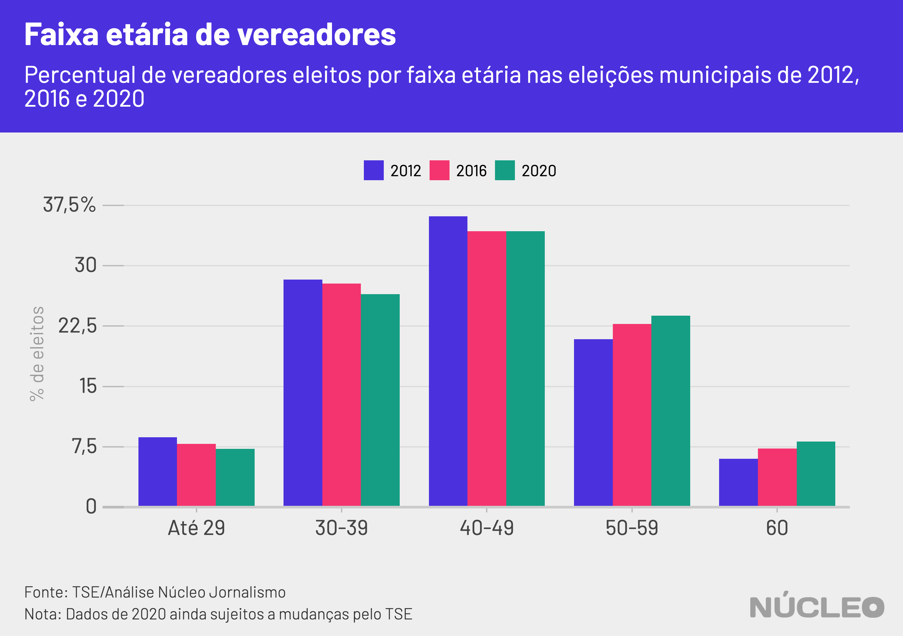
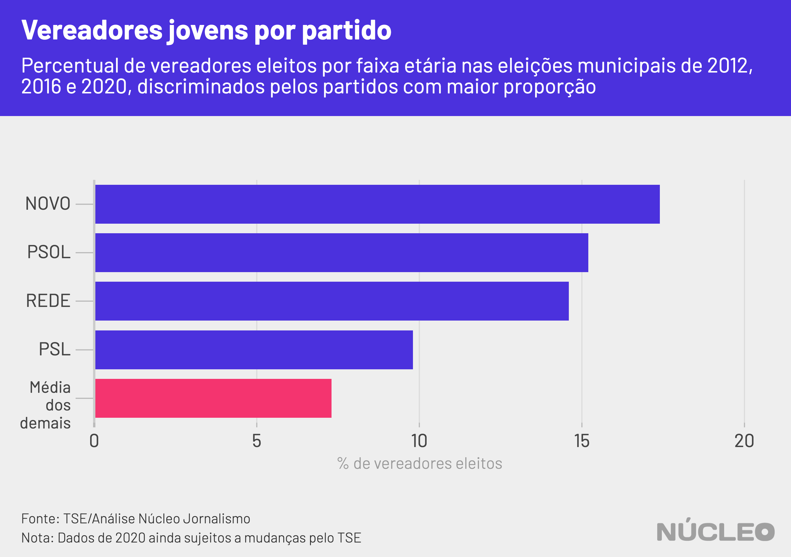
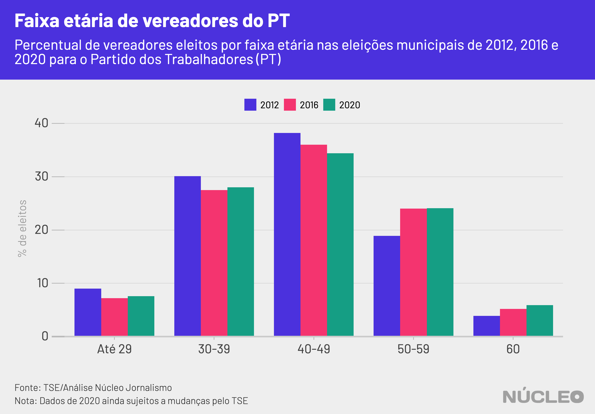

A proporção de vereadores mais jovens caiu pela segunda eleição consecutiva em 2020, totalizando 7,2% dos eleitos, indicando uma resistência à renovação nos quadros dos partidos -- ao menos no nível municipal -- mesmo em meio a movimentos de mudanças na política nacional nos últimos anos que mudaram nomes de partidos, criaram novas siglas e lançaram novos candidatos.

Em 2016, o percentual de vereadores eleitos com menos de 30 anos no momento da eleição foi de 7,9% -- quatro anos antes, em 2012, essa proporção era de 8,7%. Além disso, uma análise preliminar do Núcleo com dados da eleição 2008 indica que o percentual era ainda maior nesse ano.

---

###### É importante porque...

- *Indica dificuldade na renovação dos quadros partidários em nível municipal*

- *A consolidação dessas instituições ao longo do tempo tende a reforçar o poder de políticos que ocupam cargos na burocracia partidária*

---

Nas eleições municipais, as eleições de vereador são um evento importante para observar tendências de renovação nos partidos. Isso se deve a dois fatores:

* o grande número de cadeiras de vereador em disputa (mais de 58 mil em todo o país) que pode facilitar a entrada de estreantes;

* o mais baixo limite de idade entre todos os mandatos eletivos do país, a idade mínima de 18 anos na data da posse.

### NOS PARTIDOS

Novo, PSOL e Rede foram os partidos que elegeram os maiores percentuais de vereadores jovens dentre os seus candidatos (18-29 anos):

* 17,4% dos vereadores do Novo (4 eleitos nessa faixa);

* 15,2% do PSOL (12 eleitos);

* 14,6% da Rede (20 eleitos).

Na sequência vem o PSL (9,8%), ao passo que a média dos demais partidos é de 7,4% vereadores nessa faixa etária.

Em comum, Novo, Rede e PSOL são partidos mais jovens e/ou com baixa presença institucional. No total, o Novo elegeu 23 vereadores, o PSOL 79 e a Rede 137 - que correspondem a 0,04%, 0,14% e 0,24% do total de 56.710 cadeiras atualmente confirmadas pela Justiça Eleitoral (confira a seção de metodologia para verificar como calculamos o número de eleitos).

##### Em estudos clássicos, a ciência política já diagnosticou a dificuldade de partidos políticos renovarem seus quadros.

A consolidação dessas instituições ao longo do tempo tende a [reforçar o poder](https://www.scielo.br/scielo.php?script=sci_arttext&pid=S0102-69092014000200012) de políticos que ocupam cargos na burocracia partidária.

Este fenômeno se agravou nas últimas décadas com uma combinação de dois fatores: a [queda](https://books.google.com.br/books/about/Parties_Without_Partisans.html?id=YEkVDAAAQBAJ&redir_esc=y) do número de filiados a partidos políticos em democracias consolidadas e a construção dos chamados [partidos-carteis](https://journals.sagepub.com/doi/10.1177/1354068895001001001), que são aqueles que dependem mais de recursos (especialmente financeiros) do Estado para a sua manutenção.

Novo e PSOL são ainda dois partidos mais conectados com grandes cidades. Do total de votos nominais para vereadores nesses partidos, 94,4% e 85,4%, respectivamente, foram em municípios com mais de 200.000 eleitores (a Rede obteve 54,9% nessas cidades). Essas cidades correspondem a 38% do eleitorado nacional.

Um levantamento do [site Pindograma](https://pindograma.com.br/2020/10/02/jovens.html) indicou que o percentual de jovens entre o total de filiados a partidos políticos no Brasil diminuiu na última década. Este fenômeno, porém, não é generalizado. Enquanto PT, PDT, PSDB, PSB, MDB e DEM observaram uma diminuição no número absoluto de filiados jovens, Novo, Rede, PSL, PSOL e Patriota registraram crescimento.

Quanto ao gênero e raça desses jovens vereadores, o PSOL se destaca pela diversidade: dos 12 eleitos, 8 são mulheres, sendo que 6 autodeclaradas pretas. O Novo, por sua vez, elegeu três homens autodeclarados brancos e uma mulher branca. Desses vereadores da Rede, somente três são mulheres (15%).

### PARTIDO DOS TRABALHADORES

Após protagonizar todas as eleições presidenciais pós-redemocratização, o Partido dos Trabalhadores (PT) sofreu uma forte derrota nas eleições municipais de 2016. Em 2020, as eleições apresentaram sinais mistos para o PT.

Por um lado, [perdeu](https://g1.globo.com/politica/eleicoes/2020/eleicao-em-numeros/noticia/2020/11/16/psdb-e-mdb-perdem-o-maior-no-de-prefeituras-dem-e-pp-sao-os-que-mais-ganham.ghtml)  [cadeiras](https://g1.globo.com/politica/eleicoes/2020/eleicao-em-numeros/noticia/2020/11/17/dem-pp-e-psd-aumentam-numero-de-vereadores-no-brasil-mdb-pt-psdb-pdt-e-psb-registram-reducao.ghtml) nos dois Poderes, obteve uma[ taxa de sucesso](https://g1.globo.com/politica/eleicoes/2020/eleicao-em-numeros/noticia/2020/11/19/pp-tem-a-maior-taxa-de-sucesso-na-disputa-para-as-prefeituras-cinco-partidos-nao-elegem-nem-sequer-um-prefeito-no-pais.ghtml) de 15% das prefeituras disputadas (a menor entre partidos que elegeram mais que 100 prefeitos) e se manteve em [patamares próximos aos de 2016](https://www1.folha.uol.com.br/colunas/monicabergamo/2020/11/pt-conquista-cem-mil-votos-a-mais-do-que-em-2016-mas-integrantes-da-legenda-acham-resultado-pifio.shtml), que foi o seu pior desempenho eleitoral desde a ascensão de Luiz Inácio Lula da Silva à presidência da República.

Por outro, o partido expandiu os municípios em que disputará o segundo turno, aumentou sua votação total para o Executivo e Legislativo municipais, inclusive em capitais, onde foi o segundo partido com [maior número](https://noticias.uol.com.br/colunas/observatorio-das-eleicoes/2020/11/20/vereadores-nas-capitais-o-desempenho-dos-partidos-em-um-quadro-de-fluidez.htm) de vereadores eleitos.

Segundo [matéria](https://www1.folha.uol.com.br/poder/2020/11/pt-perde-prefeituras-mas-se-agarra-a-2o-turno-e-diz-que-foi-vitorioso.shtml) de Fábio Zanini e Carolina Linhares na Folha de S. Paulo, dirigentes petistas avaliam nos bastidores "que é preciso renovar seus líderes e reconectar-se com o eleitorado, sobretudo os mais jovens, para evitar perder ainda mais terreno no campo progressista".

##### Apesar de ser reconhecido há décadas como uma das poucas agremiações com atividade partidária orgânica no Brasil, [o PT não é exceção](http://www.teoriaepesquisa.ufscar.br/index.php/tp/article/view/186/152) nas tendências de dificuldades de renovação descritas pela ciência política.

Em 2020, 7,6% dos vereadores eleitos pelo partido tinham entre 18 e 29 anos no dia da eleição, valor levemente superior ao de 2016 (7,2%) mas ainda inferior ao de 2012 (9%).

Como enfatiza o cientista político Jairo Nicolau, as quedas do PT em 2016 estiveram diretamente relacionadas ao tamanho do município: [quanto mais populoso, maior a queda no percentual de votos para vereador](https://noticias.uol.com.br/colunas/observatorio-das-eleicoes/2020/10/12/pt-em-numeros-uma-analise-de-2000-a-2016.htm). É nesses municípios que a estratégia petista de recuperação [parece ter se focado](https://www1.folha.uol.com.br/poder/2020/10/isolado-nas-capitais-pt-mira-retomada-a-partir-de-cidades-medias.shtml).

Ao menos nas maiores cidades brasileiras, o PT avançou na eleição de lideranças jovens. Comparativamente às eleições de 2012 e 2016, o partido ampliou a fatia de seus vereadores que estão na faixa de 18 à 29 anos.

Em municípios com mais de 200 mil eleitores, eles saíram de 1,7% dos vereadores eleitos pelo partido em 2016 para 9,2% este ano. Nas capitais, os jovens passaram de 2,4% para 8,9% dos vereadores do partido nas duas últimas eleições.

Além deste aumento entre os mais jovens, é nesta faixa etária que as mulheres vereadoras alcançam sua maior representação no partido. Elas são 27,6% dos 199 vereadores  com menos de 30 anos. Nas demais faixas, este percentual fica entre 20,3% (40-49 anos) e 21,9% (60 ou mais). Nos municípios com mais de 200.000 eleitores, elas correspondem a 10 dos 11 eleitos. Entre esses jovens, 8 das 10 mulheres se autodeclaram pretas.

### COMO FIZEMOS ISSO

Para candidaturas e resultados de eleitos, utilizamos as informações dos bancos de candidaturas dos anos de 2012, 2016 e 2020 do Repositório de Dados Eleitorais. Tendo em vista a constante atualização desses dados segundo julgamentos da Justiça Eleitoral quanto ao status de algumas candidaturas, ressaltamos que os dados aqui apresentados se referem aos dados gerados no dia 27/11/2020 pelo TSE - nos quais constam 56.710 vereadores eleitos (de um total de 58.112 cadeiras de vereador em disputa).

Testamos nossos resultados com o resultado obtido via API de resultados do TSE (pacote [eleicoesmun2020](https://github.com/rmhirota/eleicoesmun2020)) - que retorna 57.376 eleitos - e com os dados de candidaturas gerados em 20/11/2020 - com 57.608 eleitos. Todos indicam resultados no mesmo sentido daqueles descritos na matéria. Considerando os resultados ainda não declarados, para que o número de jovens eleitos em 2020 se iguale ao percentual de 2016, é necessário que 32,8% das 1.402 cadeiras não declaradas sejam destinadas a candidatos com menos de 30 anos - valor largamente superior ao que elas atingiram até o momento (97,6% do total).

Para os votos dos candidatos, utilizamos dados obtidos via pacote [eleicoesmun2020](https://github.com/rmhirota/eleicoesmun2020), que extrai dados da API de resultados do TSE. Este pacote retorna o resultado eleitoral de 499.892 candidaturas a vereador - enquanto a base de dados de resultados nominais por zona, disponível no Repositório do TSE apresenta o resultado de 489.636 candidatos.

A análise se concentrou nas eleições realizadas na última década, em que novos atores partidários e dinâmicas políticas se incorporaram ao cenário do país.
